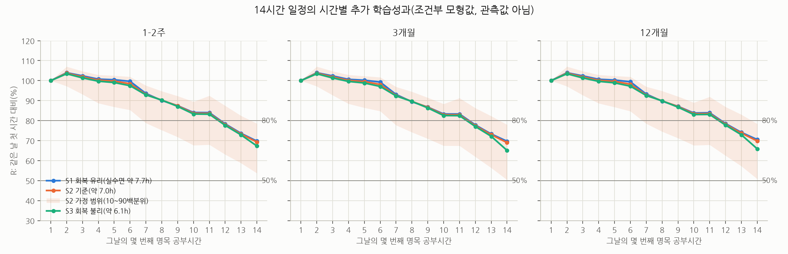
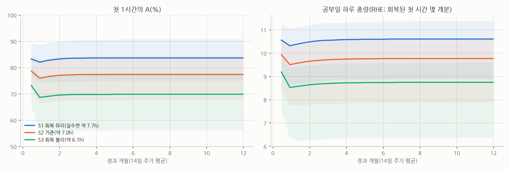

# 1부. 하루 14시간 공부에서 추가 1시간의 학습성과

> **읽는 법.** 이 문서의 시간별 퍼센트는 관측값이 아니라 **조건부 모형값**이에요. 수능 수험생이 하루 8~14시간을 1년 동안 공부할 때 시간별 학습성과를 직접 잰 연구는 찾지 못했어요. 그래서 가까운 연구들이 지지하는 방향과 크기 범위를 명시한 가정으로 이어 붙여 추정했어요. 괄호 안 범위는 가정을 바꿔 가며 계산한 **가정 범위(10~90백분위)**이고, 통계적 신뢰구간이 아니에요.
>
> - **R(t,h)** = 같은 날 첫 1시간의 학습량을 100으로 둔 h번째 명목 1시간의 학습량. 질문하신 내용에 대한 직접 답이에요.
> - **A(t,h)** = 충분히 회복된 기준 상태(수면 필요량 충족, 누적 부하 없음, 일정 적응 완료, 같은 지식수준·과제)의 첫 1시간을 100으로 둔 값. 첫 시간 자체가 얼마나 낮아졌는지 보여줘요.
> - **학습량**: 7일 뒤 지연 평가에서 확인되는, 유지되고 수능형 문제에 쓸 수 있는 학습의 증가(복습으로 막은 망각 포함). 표준화된 가상 단위이고 수능 점수로 바꾸지 않았어요.
> - **순공부시간**: 명목 공부시간 중 실제로 과제에 몰입한 시간이에요(흔히 "순공"이라 부르고, 모형에서는 관여 시간이라고 해요).
> - 모든 분모는 **명목 1시간**(책상에서 공부하려고 보낸 1시간, 짧은 휴식·이탈 포함)이에요.

---

## A. 결론부터

**"8시간 이후냐, 12시간 이후냐"에 대한 답: 둘 다 근거로 뒷받침되는 꺾임점이 아니에요.** 8시간이나 12시간에 효율이 뚝 떨어진다는 근거는 찾지 못했어요. 다만 시험·과제 수행 자료도 약 6시간까지만 있고 학습효율 자체는 측정된 적이 거의 없어서, 8시간이나 12시간에 꺾임이 **없다**고 말할 근거도 없어요. 이 보고서의 모형은 매끄러운 곡선을 가정했기 때문에 꺾임 여부를 판정할 수 없어요. 근거로 뒷받침할 수 있는 가장 안전한 결론은 다음과 같아요.

1. **처음 약 5~6시간은 시험·과제 수행 지표로는 크게 떨어지지 않았어요(학습량으로 잰 자료는 없어요).** 동기가 높은 대학생의 3.5~5.5시간 시험에서 주관적 피로는 늘었지만 객관적 수행은 떨어지지 않았어요([Ackerman & Kanfer 2009](https://doi.org/10.1037/a0015719)). 학교 하루 범위에서는 1시간 늦을수록 시험 점수가 0.9% SD 낮았고, 20~30분 휴식이 1.7% SD를 되돌렸어요([Sievertsen et al. 2016](https://doi.org/10.1073/pnas.1516947113)). 둘 다 학습이 아니라 시험 수행이라 간접 근거예요. 학습(부호화) 능력을 잰 소규모 실험에서는 낮잠 없이 12시→18시에 저하가 있었지만(Mander et al. 2011), 사전등록 실험 2건을 담은 후속 연구에서는 밤잠이 다음 날의 새 학습 능력을 높인다는 결과가 확인되지 않았어요([Guttesen et al. 2025](https://pubmed.ncbi.nlm.nih.gov/40675054/)).
2. **그 뒤의 모양은 근거가 없어서, 완만하게 누적되는 저하를 가정했어요.** 이 가정 아래 기준 모형에서 R은 7~8번째 시간에 90~95%, 9~11번째 시간에 약 85%, 12번째 약 78%, 14번째 약 70%예요. 첫 시간의 80% 이하로 처음 내려가는 시점은 기준 가정에서 **12번째 시간**이고, 가정 범위로는 **7~14번째 시간**이에요. 가정 조합의 2~12%에서는 14시간 안에 80% 이하로 내려가지 않아요. 50% 이하는 가정 조합의 약 70~96%에서 14시간 안에 나타나지 않았어요. 같은 근거로 따로 만든 독립 모형 셋의 기준값은 13번째(M2), 14번째(M3의 가정 조합 중앙값), "14시간 안에 없음"(M1)이었어요. **통합 모형이 네 모형 가운데 가장 비관적인 쪽이에요**([4부 5절](04_방법과_검증.md#5-독립-모형과의-비교)).
3. **따라서 "12시간 전후"는 이 모형의 80% 교차점일 뿐, 보편적 임계값이 아니에요.** 이 시점을 가장 크게 움직이는 가정은 하루 누적 피로 곡선의 크기와 모양이에요. 독립 모형 M3에서는 같은 크기의 저하라도 모양만 바꾸면 6번째(초반에 몰린 포화형)부터 "14시간 안에 없음"(후반에 몰린 볼록·경첩형)까지 움직였어요. 이 모양을 정해 줄 실증 자료는 없고, 초반 저하가 큰 모양만 긴 시험 연구와 어긋나요. 통합 모형에서는 곡선을 초반부터 떨어지는 오목형(모양 지수 1)으로 두면 8번째로 당겨지고, 후반 가속을 더 강하게(모양 지수 4) 두어도 12번째에 머물러요. 14번째 이후로 밀리는 것은 누적 피로가 최대치의 절반에 이르는 누적 관여시간(기준 10시간)을 13시간으로 늦추거나(14번째) 최대 저하를 25%로 낮출 때(14시간 안에 없음)예요.
4. **질문에 가장 가까운 관찰 자료는 하루 공부시간의 이득이 평탄해지는 구간을 보여 줘요. 다만 선택 효과가 섞여 있어요.** 미국 의사면허시험(USMLE Step 1) 전업 준비생 조사는 하루 8~11시간을 넘게 공부한 집단의 점수가 더 높았지만, 그보다 더 긴 공부시간에서는 추가 이득이 보이지 않았다고 보고했어요([Kumar et al. 2015](https://pubmed.ncbi.nlm.nih.gov/25910497/)). 같은 조사에서 준비 기간이 40일 미만인 학생의 점수가 더 높았는데, 이건 실력이 좋은 학생이 덜 공부해도 되는 선택 효과로 보이고, 하루 공부시간의 평탄화도 같은 이유로 생길 수 있어요. 자기보고, 단일 기관, 관찰 연구라 인과로 읽으면 안 되고, "몇 번째 시간의 효율"이 아니라 "하루 총 공부시간이라는 생활방식"의 비교예요.

**시간대보다 더 큰 변수는 하루 전체의 수준이고, 그중 근거가 있는 부분은 수면이에요.** 14시간을 공부하고 식사·위생·이동에 1.75~3시간을 쓰면, 침대에 있을 수 있는 시간은 7~8.25시간이고 실수면은 약 6.1~7.7시간이에요. 젊은 성인의 수면 필요량 추정치(평균 약 8.4시간, 개인 범위 7.3~9.3시간; [Kitamura et al. 2016](https://www.nature.com/articles/srep35812), 젊은 남성 15명)와 하루 16시간 수면 기회에서 젊은 성인이 자는 최대량(약 8.9시간; [Klerman & Dijk 2008](https://doi.org/10.1016/j.cub.2008.06.047))에 비추면 대부분의 사람에게 짧아요. 하루 각성이 약 15.8시간을 넘으면 결손이 다음 날로 쌓였다는 실험([Van Dongen et al. 2003](https://academic.oup.com/sleep/article-abstract/26/2/117/2709164))을 거꾸로 계산해도 필요 수면은 약 8.2시간이에요.

모형에서는 그날의 **첫 시간부터** 충분히 회복된 상태의 약 70~85%로 시작해요(3개월 시점 A: S1 84, S2 77, S3 70). 이 부족분을 나눠 보면, 수면부채와 공고화 몫이 S1 약 5점, S2 약 12점, S3 약 19점이고, **근거 없이 가정한 수면 외 다일 누적 부하가 약 9~10점**을 더 깎아요. 실수면 8시간을 지킨 14시간 가상 일정도 첫 시간 A가 약 87이에요(계산은 `model/counterfactuals.py`). 그래서 "몇 시부터 떨어지나"보다 "하루가 몇 %에서 시작하나"가 연간 총량을 더 크게 좌우한다는 것은 모형 안의 결론이고, 그 크기의 절반 가까이는 가정이에요.

**후반부 공부는 총량을 늘리는가: 시간을 어디서 가져오느냐에 달려 있어요.**

- **14시간 일정 안의 13~14번째 시간 블록 자체는 모형에서 양(+)의 기여를 해요.** 기준 모형에서 각각 회복된 첫 시간의 약 55%(A)예요. 효율이 낮다는 것과 기여가 0이라는 것은 달라요. **다만 이 양(+)의 기여는 모형 구조상 보장돼요.** 늦은 공부가 같은 날 앞서 배운 내용의 유지를 방해하는 간섭이나 하루 공고화 용량의 한계는 모형에 없고, 이를 정해 줄 근거도 찾지 못했어요. 독립 모형에 극단 가정을 넣어 본 점검에서는, 공부 1시간을 더할 때마다 그날 나머지 학습이 약 8% 줄어드는 간섭을 넣으면 "조건 안 최대치가 최적"이라는 결론이 뒤집혔어요(4부 5절). 같은 간섭은 후반 블록의 순기여도 줄여요.
- **그 2시간을 주로 수면에서 가져오면 순효과는 0 근처이거나 음(−)이에요. 부호는 확정할 수 없어요.** 첫 번째 질문 틀에서 12시간(실수면 8.3시간, 여가 0.6시간)과 14시간(실수면 7.0시간, 여가 0)을 비교했어요. 늘어난 2시간 중 약 1.4시간이 침대 시간에서, 0.6시간이 여가에서 나와요. 추가된 두 블록이 1년에 +374 RHE를 더하지만, 수면 감소와 누적 부하로 나머지 12시간과 공고화에서 557 RHE를 잃어요. 통합 모형의 순효과는 **−182 RHE/년(약 −5%)**이고, 독립 모형들은 −91, −14, +68(약 −3%~+2%)이었어요. 네 모형 모두에서 수면·여가 감소의 파급이 추가 블록의 기여를 대부분 또는 전부 상쇄했지만, 수면부채 1시간이 학습을 얼마나 낮추는지와 수면 필요량에 따라 부호가 갈려요. 통합 모형의 가정 조합 84%에서 음수였다는 것은 조합의 비율이지 확률이 아니에요. 청소년 일지 연구에서는 평소보다 잠을 줄이고 더 공부한 날의 다음 날에 스스로 보고한 학업 곤란이 더 많았어요([Gillen-O'Neel et al. 2013](https://doi.org/10.1111/j.1467-8624.2012.01834.x), 개인 내 상관). 이 연구는 추가 공부로 얻은 학습량을 재지 않아서 순효과를 보여 주지는 않아요.
- **그 2시간을 여가에서 가져오면(수면은 그대로) 모형상 순효과는 양(+)이에요.** 기준 +217 RHE/년(약 +7%), 가정 조합의 94%에서 양수였어요. 다만 여가를 0으로 만드는 비용(소진, 중도 이탈 위험)은 이 모형이 담지 못해요.

**근거 수준 요약**: "8·12시간에 꺾임이 있다는 근거는 없다"는 확실하지만, 약 6시간 이후는 측정이 없어서 곡선 모양은 모르는 상태예요. "수면을 깎아 12시간을 14시간으로 늘려도 뚜렷한 순증가는 기대하기 어렵다"는 네 모형과 일지 연구의 방향이 일치하지만, 부호(손해인지 본전인지)는 가정에 달려 있어요. "몇 번째 시간에 80%가 되는가"는 가정에 매우 민감한 조건부 추정이에요.

---

## B. 기준 가정과 근거의 한계

### B-1. 세 시나리오의 24시간 예산 (공부일 기준, 모두 합계 24.0시간)

| 항목 | S1 회복 유리 | S2 기준 | S3 회복 불리 | 성격 |
|---|---|---|---|---|
| 명목 공부 | 14.0h (3블록: 약 4.8/5.3/3.9h) | 14.0h | 14.0h | 질문 조건 |
| 식사·위생·잡무·이동(공부 블록 밖) | 1.75h | 2.5h | 3.0h | 가정(운동·명상 없음) |
| 침대 시간 | 8.25h | 7.5h | 7.0h | 24h 산술 |
| 실수면(수면효율 0.93 / S3는 0.90, 불규칙 손실 0.2h) | 약 7.7h | 약 7.0h | 약 6.1h | 가정 |
| 깨어 있는 시간 | 약 16.3h | 약 17.0h | 약 17.9h | 산술 |
| 휴일 | 14일마다 1일, 휴일 밤 +1h 수면 | 같음 | 같음 | 질문 조건 + 가정 |

S1도 식사·위생을 1.75시간으로 줄여야 성립하는 빠듯한 일정이에요. 실수면 8시간을 지키려면 침대에 8.4~8.9시간이 필요해서, 14시간 공부와 합치면 식사·위생에 1.1~1.6시간만 남아요.

### B-2. 모형 가정과 근거의 성격

| 항목 | 기준값 (민감도 범위) | 성격 | 근거 출처와 메모 |
|---|---|---|---|
| 성과 측정 | 7일 지연 평가 기준의 유지·적용 가능한 학습, 표준화 가상 단위 | 정의 | 7일은 인출연습 연구의 표준 지연이지만, 수개월 뒤 시험 기준으로는 간격 효과를 과소평가하고(1주 시험 0, 4주 시험 약 2배: [Rohrer & Taylor 2006](https://doi.org/10.1002/acp.1266); [Cepeda et al. 2008](https://eric.ed.gov/?id=ED505660)) 과잉학습을 과대평가할 수 있어요([Rohrer et al. 2005](https://doi.org/10.1002/acp.1083)) |
| 과제 구성 | 모든 시간에 같은 대표 과제 묶음 | 분석 선택 | 비교 가능성을 위해. 배치 효과는 C-4 |
| 관여 비율(순공부시간/명목 공부시간) | 80% (70~90%), 피로가 쌓이면 감소 | 모형 가정 | 방향만 차용: [Szpunar et al. 2013](https://doi.org/10.1073/pnas.1221764110) |
| 첫 20분 워밍업 | 관여 25% 감소 (0~45%) | 모형 가정 | 두 번째 시간이 첫 시간보다 높을 수 있게 허용 |
| 오전 저하 | 이른 아침 최대 4% (0~8%) | 간접 추정 | [Roenneberg et al. 2004](https://pubmed.ncbi.nlm.nih.gov/15620633/)(생활리듬이 가장 늦은 나이 약 20세); 동조효과 비일관 [Chauhan et al. 2025](https://doi.org/10.1080/07420528.2025.2490495) |
| 오후 저하 | 14:30 전후 최대 3% (0~6%) | 간접 추정 | Monk 2005(조사 단계 확인), 개인차 큼 |
| 블록 내 과제지속 피로 | 최대 6% (2~12%), 식사 휴식에서 75% (50~100%) 회복 | 간접 추정 | [Sievertsen et al. 2016](https://doi.org/10.1073/pnas.1516947113); [Albulescu et al. 2022](https://doi.org/10.1371/journal.pone.0272460). 회복 비율 자체는 가정 |
| 하루 누적 피로(수면으로만 해소) | 누적 관여 10시간(8~13)에서 최대치의 절반, 최대 45% (25~65%), 모양 지수 3(후반 가속형), 범위 1~4(1은 초반부터 떨어지는 오목형) | **모형 가정** | 5시간대까지 시험 수행 저하가 뚜렷하지 않고([Ackerman & Kanfer 2009](https://doi.org/10.1037/a0015719)), 6시간 넘는 고난도 작업 뒤 즉시 보상 선호가 늘었고([Blain et al. 2016](https://doi.org/10.1073/pnas.1520527113)) 하루 분량의 작업 뒤 저노력 선택이 늘었다([Wiehler et al. 2022](https://pubmed.ncbi.nlm.nih.gov/35961314/))는 것 말고는 크기를 정할 자료가 없어요 |
| 늦은 시각 각성 저하 | 깨어 있은 지 약 16h(15.1~16.6) 이후, 수면부채가 시작을 앞당김 | 간접 추정 + 모형 가정 | 일주기 각성 신호가 약 16시간까지 수면압을 상쇄(Dijk & Czeisler 1994 등, 조사 단계 확인); 하루 각성 약 15.8시간 초과 시 결손 누적([Van Dongen et al. 2003](https://academic.oup.com/sleep/article-abstract/26/2/117/2709164)) |
| 수면 필요량 | 실수면 8.3h (7.8~8.8) | 문헌 제약 | [Kitamura et al. 2016](https://www.nature.com/articles/srep35812)(평균 8.4, 개인 7.3~9.3); [Klerman & Dijk 2008](https://doi.org/10.1016/j.cub.2008.06.047)(최대 수면량 8.9); [Van Dongen et al. 2003](https://academic.oup.com/sleep/article-abstract/26/2/117/2709164)(역산 약 8.2) |
| 수면부채 → 학습효율 | 부채(시간 환산)당 1.5% (0.7~2.8%), 평형 수렴 속도 λ 0.2/일 (0.1~0.35) | 간접 추정 | 수면제한 메타분석 장기기억 g=−0.19, 실행기능 −0.32([Lowe et al. 2017](https://pubmed.ncbi.nlm.nih.gov/28757454/)), 부분제한 후 부호화 저하([Cousins et al. 2018](https://doi.org/10.1111/jsr.12578)). 효과크기를 비율로 옮기는 환산과 λ는 가정 |
| 그날 밤 수면 → 공고화 | 완전 박탈 시 25% (10~40%) 손실, 부족분에 선형 | 간접 추정 | [Newbury et al. 2021](https://pmc.ncbi.nlm.nih.gov/articles/PMC8893218/); [Berres & Erdfelder 2021](https://www.semanticscholar.org/paper/The-sleep-benefit-in-episodic-memory:-An-review-and-Berres-Erdfelder/53a678d237a397ff6a46876285423bfff550718c) |
| 수면 외 다일 누적 부하 | 하루 관여 6h 초과분이 쌓이고 약 10일 시간상수로 감쇠, 휴일에 35% 회복, 첫 시간을 최대 25% 낮춤 | **모형 가정** | 방향만 차용: 1~4주 안에 사라지는 휴가 효과([de Bloom et al. 2009](https://doi.org/10.1539/joh.K8004); [Speth et al. 2024](https://doi.org/10.1027/1016-9040/a000518)), 학생 소진-성취 r=−0.24([Madigan & Curran 2021](https://doi.org/10.1007/s10648-020-09533-1), 사람 간 상관이라 효과크기로 옮기지 않았어요). 3개월 시점 첫 시간 A를 약 10점 낮추는, 결과에 큰 영향을 주는 가정이에요 |
| 적응 | 초기 관여 8% 감소가 약 3주 시간상수로 해소, 일중 저하 최대 20% 감소 | 모형 가정 + 간접 추정 | [Brown et al. 2025](https://academic.oup.com/qje/article/140/2/943/7925870)(시험 내 저하 22% 감소) |
| 시점 값 | 해당 14일 주기의 공부일 13일 평균 | 정의 | |

**근거의 한계**

- 학습과 가장 가까운 간접 근거(시험 수행)가 있는 가장 긴 구간은 약 5.5시간이에요. 6시간 넘는 고난도 작업 연구는 오히려 선택 방식의 변화를 보고했어요. 학습량 자체의 하루 곡선은 측정된 적이 거의 없고, 6~14번째 시간은 전부 외삽이에요.
- 수면 연구의 결손 지표는 대부분 반응속도·주의 실패(PVT)예요. 이걸 장기 학습 손실로 옮기는 비율(모형의 수면부채 계수)은 간접 추정이고, 결론을 바꾸는 핵심 모수예요(F절).
- 13일 공부 + 1일 휴식 주기, 1년 동안의 누적, 휴일 빈도를 비교한 학습 연구는 찾지 못했어요. 이 부분은 직장인의 웰빙 연구와 가정으로 채웠어요.
- 상위권 수험생의 공부시간 사례나 "하루 4시간 한계" 같은 통설은 근거로 쓰지 않았어요. 4시간 문구는 1993년 문헌 검토가 선행연구를 요약한 표현이고, 2시간을 넘으면 이득이 줄고 실효 연습은 하루 1시간에 가까울 수 있다는 문장이 이어져요([Ericsson et al. 1993](https://doi.org/10.1037/0033-295X.100.3.363)). 이 연구의 핵심 주장(의도적 연습이 수행을 설명하는 정도)도 재현 연구에서는 더 작게 나왔어요(세 집단 비교 26%, [Macnamara & Maitra 2019](https://doi.org/10.1098/rsos.190327)).

---

## C. 핵심 시간별 예측표

### C-1. S2(기준 시나리오)의 시간별 R과 A: 조건부 모형값

값은 5% 단위로 반올림했어요. 괄호는 가정 범위(10~90백분위)이고, 모든 시점에서 첫 시간 R은 정의상 정확히 100이에요.

| 몇 번째 시간 | 초기 1~2주 R | 3개월 R | 12개월 R | 12개월 A |
|---|---|---|---|---|
| 1 | 100 | 100 | 100 | 75 (70~85) |
| 2 | 105 (95~105) | 105 (95~105) | 105 (95~105) | 80 (70~85) |
| 3 | 100 (95~105) | 100 (95~105) | 100 (95~105) | 80 (65~85) |
| 4 | 100 (90~105) | 100 (90~105) | 100 (90~105) | 80 (65~80) |
| 5 | 100 (85~105) | 100 (85~100) | 100 (85~100) | 75 (60~80) |
| 6 | 100 (85~100) | 100 (85~100) | 100 (85~100) | 75 (60~80) |
| 7 | 95 (80~100) | 95 (80~95) | 95 (80~95) | 70 (55~75) |
| 8 | 90 (75~95) | 90 (75~95) | 90 (75~95) | 70 (55~75) |
| 9 | 85 (70~90) | 85 (70~90) | 85 (70~90) | 65 (50~75) |
| 10 | 85 (70~90) | 85 (65~90) | 85 (70~90) | 65 (50~70) |
| 11 | 85 (70~90) | 85 (65~90) | 85 (70~90) | 65 (50~75) |
| 12 | 80 (65~85) | 75 (60~85) | 80 (65~85) | 60 (45~70) |
| 13 | 75 (60~80) | 75 (55~80) | 75 (55~85) | 55 (40~65) |
| 14 | 70 (55~80) | 70 (50~80) | 70 (50~80) | 55 (35~65) |

1개월·6개월 값도 3개월과 5% 이내로 같아서 표에서는 줄였어요(`model/outputs/tables.md`에 전체가 있어요).

**읽을 때 주의할 점**

- **2번째 시간이 105인 이유**: 하루 첫 20분의 준비·몰입 지연과 이른 아침의 저하를 가정했기 때문이에요. 워밍업을 0으로 두면 첫 시간이 최고점이 되고 80% 교차가 10번째 시간으로 당겨져요(F절 민감도).
- **일시적 저하와 지속적 저하**: 7~8번째 시간의 하락에는 점심 뒤 오후 저하와 블록 후반 피로가 섞여 있고, 저녁 식사 뒤(11번째 시간 부근) 일부 회복돼요. 반면 하루 누적 관여에 따른 저하는 수면 전까지 회복되지 않아서, 11번째 이후의 하락은 대체로 지속적이에요.
- **초기와 장기의 R은 거의 같아요.** 수면부채와 누적 부하는 주로 하루 전체를 같이 낮추고(A), 하루 안의 기울기(R)는 크게 바꾸지 않았어요. 수면부채가 하루 안 기울기를 얼마나 가파르게 만드는지는 근거로 정할 수 없어서, 모형에서는 작게 두고 민감도에 넣었어요.

### C-2. 시나리오별 비교

| 몇 번째 시간 | S1 3개월 R | S2 3개월 R | S3 3개월 R | S1 12개월 A | S2 12개월 A | S3 12개월 A |
|---|---|---|---|---|---|---|
| 1 | 100 | 100 | 100 | 85 (75~90) | 75 (70~85) | 70 (55~80) |
| 2 | 105 (95~105) | 105 (95~105) | 105 (95~105) | 85 (75~95) | 80 (70~85) | 70 (55~80) |
| 4 | 100 (90~105) | 100 (90~105) | 100 (90~100) | 85 (70~90) | 80 (65~80) | 70 (55~75) |
| 6 | 100 (85~105) | 100 (85~100) | 95 (85~100) | 85 (70~90) | 75 (60~80) | 70 (50~75) |
| 8 | 90 (75~95) | 90 (75~95) | 90 (75~95) | 75 (60~80) | 70 (55~75) | 65 (45~70) |
| 10 | 85 (70~90) | 85 (65~90) | 85 (65~90) | 70 (55~75) | 65 (50~70) | 60 (40~65) |
| 12 | 80 (60~85) | 75 (60~85) | 75 (60~85) | 65 (50~75) | 60 (45~70) | 55 (35~65) |
| 13 | 75 (55~85) | 75 (55~80) | 70 (50~80) | 60 (45~70) | 55 (40~65) | 50 (30~60) |
| 14 | 70 (55~80) | 70 (50~80) | 65 (35~75) | 60 (45~70) | 55 (35~65) | 45 (20~55) |

세 시나리오의 차이는 R(하루 안 모양)보다 A(하루 전체 수준)에서 커요. 수면이 6시간대인 S3의 14번째 시간은 회복된 첫 시간의 절반 아래(45)로 내려가요.

### C-3. 80%·50% 보조 기준

아래 80%·50%는 비교를 위한 편의 기준이지 생물학적 경계가 아니에요.

| 시나리오 | 시점 | R이 처음 80% 이하가 되는 시간: 기준 (가정 범위) | 14시간 안에 80% 미도달 조합 | R이 처음 50% 이하가 되는 시간: 기준 | 14시간 안에 50% 미도달 조합 |
|---|---|---|---|---|---|
| S1 | 1~2주 / 3개월 / 12개월 | 12번째 (7~14; 6·12개월은 7~없음) | 9~12% | 14시간 안에 없음 | 93~96% |
| S2 | 1~2주 / 3개월 / 12개월 | 12번째 (7~14) | 6~7% | 14시간 안에 없음 | 90~95% |
| S3 | 1~2주 / 3개월 / 12개월 | 12번째 (7~14) | 2~3% | 14시간 안에 없음 | 72~88% |

**"거의 무의미한 시간"의 판정**: 예를 들어 "회복된 첫 시간의 25% 미만"을 거의 무의미한 수준으로 잡으면, 기준 모형에서는 14시간 안에 그 수준에 이르는 시간이 없어요. 가장 비관적인 10% 가정 조합의 S3(실수면 약 6.1시간)에서만 14번째 시간의 A가 약 20으로 이 기준 아래까지 내려가요. 기준을 A 50% 미만으로 느슨하게 잡으면 S3 기준값의 14번째 시간(45)이 여기에 들어가요. 그래서 "후반 시간은 무의미하다"는 결론은 수면이 크게 부족한 경우가 아니면 이 모형의 구조와 가정 범위에서는 나올 수 없어요(같은 날 간섭이나 공고화 용량 한계가 모형에 없기 때문이에요). 다만 이건 **그 시간이 수면을 깎지 않는다는 전제**의 이야기예요(E절).

### C-4. 과제 배치에 따른 차이

모형의 기준 표는 모든 시간에 같은 과제 묶음을 가정했어요. 실제로는 무엇으로 그 시간을 채우느냐가 시간대만큼, 또는 그보다 크게 작용할 수 있어요.

- **같은 내용을 한 번에 계속 반복하는 것**의 추가 이득은 빨리 줄어요. 수학 문제를 한 번에 9개 대신 3개 풀어도 1·4주 뒤 차이가 없었고, 같은 10문제를 1주 간격으로 나누면 4주 점수가 거의 두 배였어요([Rohrer & Taylor 2006](https://doi.org/10.1002/acp.1266)). 이건 "몇 번째 시간"이 아니라 "같은 내용을 몇 시간째 붙들고 있느냐"에 따라 추가 이득이 줄어드는 현상(수확 체감)이에요. 과목을 바꾸면 상당 부분 피할 수 있어요.
- **인출연습(스스로 떠올리기·문제 풀기)**의 효과는 재학습 대비 g≈0.50이었고([Rowland 2014](https://doi.org/10.1037/a0037559); 교실 연구 [Yang et al. 2021](https://pubmed.ncbi.nlm.nih.gov/33683913/)), 전이 효과는 전체 d=0.40으로, 응용·추론 문항에서 특히 컸어요([Pan & Rickard 2018](https://pubmed.ncbi.nlm.nih.gov/29733621/)). 수학에서는 간격 효과가 g=0.28로 작고([Murray et al. 2025](https://doi.org/10.1007/s10648-025-10035-1)) 효과가 없었던 연구도 있어요([Ebersbach & Barzagar Nazari 2020](https://doi.org/10.3389/fpsyg.2020.00811)).
- **수동적 강의 시청**: 실험실 강의 영상에서는 시간이 지날수록 마음 방황이 늘었다는 보고가 있지만(Risko et al. 2012, 조사 단계 확인), 동기가 걸린 실제 수업에서는 늘지 않았다는 연구도 있어요(Wammes et al. 2016, 조사 단계 확인). 중간 퀴즈는 마음 방황을 줄이고 학습을 높였어요([Szpunar et al. 2013](https://doi.org/10.1073/pnas.1221764110)). 모형에서는 피로에 가장 민감한 과제로 가정했어요. 반대로 동기가 걸린 시간제한 문제풀이는 긴 시험 연구처럼 비교적 버티는 쪽이에요.
- **늦은 시간의 위험은 "배울 수 없음"보다 "힘이 덜 드는 공부 방식으로 빠지는 것"일 수 있어요.** 6시간 넘는 고난도 작업 뒤에는 즉시 보상 선호가 늘었고([Blain et al. 2016](https://doi.org/10.1073/pnas.1520527113)), 하루 분량의 작업 뒤에는 저노력·단기 선택이 늘었어요([Wiehler et al. 2022](https://pubmed.ncbi.nlm.nih.gov/35961314/)). 공부에 대해 직접 검증된 추론은 아니에요.

독립적으로 만든 과제 배치 중심 모형(M2, [4부](04_방법과_검증.md#5-독립-모형과의-비교))으로 계산해 보면, 새 개념을 오전과 식사 직후에, 인출·모의고사를 저녁에 두도록 배치를 최적화했을 때 **연간 총량은 약 2%만 늘었지만 시간별 모양은 크게 바뀌었어요.** S2의 13~14번째 시간 A가 55~60에서 70~73으로 올라갔어요. 이 크기는 과제별 효율·피로 민감도라는 가정에 달려 있어요. 배치를 바꾸면 첫 시간에 무엇을 하느냐에 따라 R의 분모가 달라지므로, 배치끼리의 비교는 R이 아니라 A로 해야 해요.

---

## D. 1년 동안의 변화

| 시나리오 | 시점 | 첫 1시간 A | 공부일 하루 총량(RHE) | 9~14번째 시간의 기여(RHE) | 13~14번째 시간의 기여(RHE) | 9~14번째 시간의 비중 |
|---|---|---|---|---|---|---|
| S1 | 초기(1~2주) | 85 (75~90) | 10.6 (9.0~11.2) | 4.0 (3.2~4.4) | 1.2 (0.9~1.4) | 38% (35~40%) |
| S1 | 1개월 | 85 (75~90) | 10.4 (8.7~11.1) | 3.9 (3.0~4.4) | 1.2 (0.9~1.4) | 37% (34~40%) |
| S1 | 3개월 | 85 (75~90) | 10.6 (8.8~11.3) | 4.0 (3.1~4.5) | 1.2 (0.9~1.4) | 38% (34~40%) |
| S1 | 6개월 | 85 (75~90) | 10.6 (8.9~11.4) | 4.0 (3.1~4.5) | 1.2 (0.9~1.4) | 38% (34~40%) |
| S1 | 12개월 | 85 (75~90) | 10.6 (8.9~11.4) | 4.0 (3.1~4.5) | 1.2 (0.9~1.4) | 38% (35~40%) |
| S2 | 초기(1~2주) | 80 (70~85) | 9.9 (8.4~10.6) | 3.7 (3.0~4.1) | 1.1 (0.9~1.3) | 38% (35~40%) |
| S2 | 1개월 | 75 (65~85) | 9.6 (7.8~10.4) | 3.6 (2.7~4.0) | 1.1 (0.8~1.2) | 37% (34~40%) |
| S2 | 3개월 | 75 (70~85) | 9.7 (7.8~10.6) | 3.7 (2.7~4.1) | 1.1 (0.8~1.3) | 38% (34~40%) |
| S2 | 6개월 | 75 (70~85) | 9.8 (7.9~10.6) | 3.7 (2.7~4.2) | 1.1 (0.8~1.3) | 38% (34~40%) |
| S2 | 12개월 | 75 (70~85) | 9.8 (7.9~10.6) | 3.7 (2.7~4.2) | 1.1 (0.8~1.3) | 38% (34~40%) |
| S3 | 초기(1~2주) | 75 (65~80) | 9.2 (7.6~9.9) | 3.5 (2.7~3.8) | 1.0 (0.7~1.2) | 38% (34~40%) |
| S3 | 1개월 | 70 (55~75) | 8.6 (6.2~9.4) | 3.2 (2.2~3.6) | 0.9 (0.5~1.1) | 37% (32~39%) |
| S3 | 3개월 | 70 (55~80) | 8.7 (6.3~9.5) | 3.3 (2.2~3.7) | 1.0 (0.5~1.1) | 37% (32~39%) |
| S3 | 6개월 | 70 (55~80) | 8.7 (6.4~9.6) | 3.3 (2.2~3.7) | 1.0 (0.5~1.1) | 38% (32~39%) |
| S3 | 12개월 | 70 (55~80) | 8.8 (6.4~9.6) | 3.3 (2.2~3.7) | 1.0 (0.5~1.1) | 38% (33~39%) |

RHE는 "충분히 회복된 첫 1시간 몇 개분"이에요. 예를 들어 S2의 공부일 하루 14시간은 회복된 상태의 첫 시간 약 9.7개분에 해당해요. 괄호는 가정 범위(10~90백분위)예요. "9~14번째 시간의 기여"는 하루 후반 6시간이 더한 양이고, "13~14번째 시간의 기여"는 A절에서 논의한 마지막 두 시간의 양이에요. 예를 들어 S2의 12개월 시점에 마지막 두 시간은 회복된 첫 시간 약 1.1개분을 더해요.

**변화의 모양: 주로 처음 2~4주에 생기고 그 뒤로는 거의 평평해요.**

- 시작 직후에는 수면부채와 누적 부하가 아직 쌓이지 않았지만 일정 적응이 덜 된 상태예요. 첫 한 달 동안 수면부채가 평형으로 가고 누적 부하도 거의 일정한 수준에 이른다고 가정했어요. 이 가정 때문에 S2·S3의 첫 시간 A가 1개월 무렵 2~4점 내려가요(표의 5점 단위 반올림 때문에 더 커 보여요). 다만 중등도 제한에서 수행이 평형으로 수렴하는지는 연구마다 달라요. Belenky 연구(7일, 침대 7시간·5시간)는 수행이 떨어진 뒤 안정된다고 보고했고([Belenky et al. 2003](https://doi.org/10.1046/j.1365-2869.2003.00337.x)), 수리 모형도 평형 수렴을 예측했어요([McCauley et al. 2009](https://www.sciencedirect.com/science/article/abs/pii/S0022519308004761)). 반면 Van Dongen 연구(14일, 침대 6시간 이하)에서는 연구 기간 내내 결손이 누적됐어요. 모형의 평형 속도(λ)는 가정이고, 느리게 두면 연중 악화가 커지고 수면을 깎은 12→14 연장의 순효과도 −517 RHE까지 내려가요.
- 그 뒤로는 인지 지구력 적응(일중 저하 감소)과 누적 부하가 서로 상쇄되어, 3개월과 12개월의 차이는 이 모형의 해상도(5%) 안이에요.
- **초기와 연말의 차이를 뒷받침할 근거는 부족해요.** 그래서 모형에서 차이를 억지로 만들지 않았어요. 실제로는 연말에 모의고사·실전 연습 비중이 커지고 시험 압박이 달라지는데, 이것이 시간당 학습량을 올리는지 내리는지는 근거로 구별할 수 없어요.
- 이 평평한 모양은 "1년 동안 선형으로 누적되지 않는다"는 가정의 결과이기도 해요. 수면을 크게 깎는 일정(하루 각성 20시간 이상)에서는 결손이 끝없이 커질 수 있지만, 이 질문의 범위는 아니에요.

**휴일 직후와 직전(12개월 시점)**: 휴일 다음 날의 첫 시간 A가 휴일 직전보다 4~5점 높고, 하루 총량이 약 7% 많아요(S2: 10.2 대 9.5 RHE). 하루 안의 R 모양은 거의 같아요. 이 차이는 "휴일에 수면을 1시간 더 자고 누적 부하가 35% 회복된다"는 가정에서 나온 값이에요.

---

## E. 8·10·12·14시간 일정의 비교

같은 13+1 휴일 주기에서 각 일일 공부시간을 1년 동안 유지하는 경우예요. 14시간 일정의 앞 8시간을 잘라서 8시간 일정으로 쓰지 않고, 각 일정을 따로 시뮬레이션했어요. 공부를 줄여 생긴 시간을 어디에 쓰는지에 따라 두 경로를 계산했어요(생활 2.5시간은 동일).

- **수면 우선 경로**: 수면을 필요량(실수면 8.3시간)까지 채우고, 남는 시간은 여가로 써요.
- **수면 고정 경로**: 수면은 14시간 일정과 같은 7.0시간으로 두고, 남는 시간은 전부 여가로 써요.

### E-1. 연간 총량(RHE)

| 경로 | 공부일 명목 공부시간 | 실수면 | 공부일 자유 여가 | 연간 명목 공부시간 | 연간 RHE: 기준 (가정 범위) | 공부일 하루 평균 RHE |
|---|---|---|---|---|---|---|
| 수면 우선 | 8h | 8.3h | 4.6h | 2,712h | 2,683 (2,381~2,705) | 7.9 |
| 수면 우선 | 10h | 8.3h | 2.6h | 3,390h | 3,168 (2,788~3,264) | 9.3 |
| 수면 우선 | 12h | 8.3h | 0.6h | 4,068h | **3,486** (2,972~3,650) | **10.3** |
| (공통) | 14h | 7.0h | 0h | 4,746h | 3,304 (2,672~3,578) | 9.7 |
| 수면 고정 | 8h | 7.0h | 6.0h | 2,712h | 2,337 (1,976~2,432) | 6.9 |
| 수면 고정 | 10h | 7.0h | 4.0h | 3,390h | 2,767 (2,324~2,921) | 8.2 |
| 수면 고정 | 12h | 7.0h | 2.0h | 4,068h | 3,087 (2,556~3,269) | 9.1 |

### E-2. 연장 1단계씩의 추가 기여와 파급

| 경로 | 연장 | 추가된 시간 블록의 기여 | 나머지 시간·날에 대한 파급 | 순효과: 기준 (가정 범위) | 순효과가 음수인 조합 |
|---|---|---|---|---|---|
| 수면 우선 | 8→10h | +596 | −111 | **+486** (+364~+584), 약 +18% | 0% |
| 수면 우선 | 10→12h | +495 | −177 | **+318** (+136~+425), 약 +10% | 1% |
| 수면 우선 | 12→14h | +374 | −557 | **−182** (−456~+48), 약 −5% | 84% |
| 수면 고정 | 8→10h | +521 | −91 | +430 (+319~+515) | 0% |
| 수면 고정 | 10→12h | +440 | −120 | +319 (+193~+398) | 0% |
| 수면 고정 | 12→14h | +374 | −157 | +217 (+44~+320), 약 +7% | 6% |

단위는 RHE/년이에요. "추가된 시간 블록의 기여"는 긴 일정에서 새로 생긴 시간들이 직접 더한 양이고, "파급"은 그 연장 때문에 원래 있던 시간과 다른 날(수면부채, 공고화, 누적 부하)에서 줄어든 양이에요. A절에서 말한 "13~14번째 시간 블록 자체의 기여"(회복된 첫 시간의 약 55%)와 이 표의 "연장의 순효과"는 서로 다른 수치예요.

**RHE 비교의 한계**: RHE는 지식이 쌓일수록 같은 1시간의 이득이 줄어드는 효과(학습곡선 체감)를 뺀 값이에요. 공부시간이 긴 일정일수록 누적 학습이 많아 이 체감을 더 크게 받으므로, RHE 비교는 **긴 일정의 우위 폭을 과대평가하는 쪽**이에요. 최종 성과가 누적 학습량의 증가함수라면 총량의 순위(예: 12시간이 14시간보다 많은지)는 바뀌지 않지만, 증가폭(+18%, +10% 등)은 실제로는 더 작을 수 있어요.

**해석**

- **8→10→12시간은 두 경로 모두 분명한 순증가예요.** 다만 증가폭은 줄어요(+18% → +10%).
- **12→14시간은 시간을 어디서 가져오느냐에 따라 결과가 크게 달라져요.** 수면에서 가져오면 통합 모형 기준 약 −5%(가정 조합의 84%가 음수지만 이건 확률이 아니에요), 독립 모형은 −3%~+2%라서 0 근처이거나 손해예요. 여가에서 가져오면 통합 모형 기준 약 +7%예요. 그런데 현실적 생활시간을 두면 14시간 일정은 거의 필연적으로 수면을 깎아요(B-1). 그래서 "14시간이 12시간보다 낫다"를 기대할 근거는 약해요.
- **장기 순효과를 확정할 수 없는 부분**: 수면부채 1시간이 학습효율을 얼마나 낮추는지(모형의 κ_s)가 이 부호를 좌우해요. 하한(0.7%/부채시간)이면 12→14의 순효과가 거의 0(−3), 상한(2.8%)이면 −474예요. 수면 필요량이 7.8시간인 사람은 순효과가 0 근처(+1)예요. 계산 가능한 부분(추가 블록의 기여 +374)과 가정에 의존하는 부분(수면을 통한 파급 −557)을 따로 적은 이유예요.

---

## F. 최종 신뢰도와 판단을 바꾸는 정보

### F-1. 상대적으로 확실한 결론

1. **8시간이나 12시간에 생물학적 꺾임점이 있다는 근거는 없어요.** 다만 약 6시간 이후는 측정이 없어서, 꺾임이 없다는 뜻은 아니에요. 측정된 범위(약 6시간까지)에서 시험·과제 **수행**의 저하는 작았고 휴식·보상으로 되돌아왔어요([Sievertsen et al. 2016](https://doi.org/10.1073/pnas.1516947113); [Ackerman & Kanfer 2009](https://doi.org/10.1037/a0015719); [Hopstaken et al. 2015](https://doi.org/10.1111/psyp.12339)). 다만 이건 학습량이 아니라 수행 지표예요. 학습(부호화) 능력을 잰 소규모 실험에서는 낮잠 없이 12시→18시에 저하가 있었고(Mander et al. 2011, 크기 미확인), 사전등록 실험 2건을 담은 후속 연구([Guttesen et al. 2025](https://pubmed.ncbi.nlm.nih.gov/40675054/))에서는 밤잠이 다음 날의 새 학습 능력을 높인다는 결과가 확인되지 않았어요. 학습효율의 하루 곡선 자체는 측정된 적이 거의 없어요.
2. **현실적 생활시간을 두면 14시간 일정은 수면을 필요량 아래로 깎고, 그 비용은 하루의 모든 시간에 걸려요.** 수면제한의 누적 결손([Van Dongen et al. 2003](https://academic.oup.com/sleep/article-abstract/26/2/117/2709164); [Lowe et al. 2017](https://pubmed.ncbi.nlm.nih.gov/28757454/))과 부호화 저하([Cousins et al. 2018](https://doi.org/10.1111/jsr.12578))는 방향이 일관돼요.
3. **수면을 깎아 12시간을 14시간으로 늘려도 뚜렷한 순증가는 기대하기 어려워요.** 네 모형의 순효과가 −5%~+2%였고, 청소년 일지 연구에서 잠을 줄이고 더 공부한 다음 날 스스로 보고한 학업 곤란이 많았던 것([Gillen-O'Neel et al. 2013](https://doi.org/10.1111/j.1467-8624.2012.01834.x), 개인 내 상관)과 방향이 같아요. 손해인지 본전인지(부호)는 F-2의 가정에 달려 있어요. 같은 1시간을 더 공부해도 낮잠보다 1주 뒤 기억이 낫지 않았다는 실험([Cousins et al. 2019](https://doi.org/10.1093/sleep/zsy207), 밤잠을 줄인 연구는 아니에요)은 추가 공부의 이득이 생각보다 작을 수 있다는 보조 근거예요.
4. **같은 1시간이라도 방법에 따라 지연 시험 성과가 달라져요.** 인출·간격·교차 연습은 같은 시간 동안 지연 시험 점수를 d≈0.3~0.5 높였어요. 이 크기는 모형의 시간별 저하(R)와 같은 단위로 비교할 수 없지만, 시간을 늘리는 것만큼 방법이 중요할 수 있다는 방향의 근거예요.

### F-2. 가정에 민감한 결론

| 결론 | 가장 크게 움직이는 가정 | 움직이는 폭 |
|---|---|---|
| R이 처음 80% 이하가 되는 시간(기준 12번째) | 하루 누적 피로 곡선의 모양·크기(g_max, W50, p), 관여 비율, 워밍업. 모형 구조 자체 | 모양 지수 1(초반부터 떨어지는 오목형)이면 8번째, 최대 저하 25%면 14시간 안에 없음. 독립 모형들은 13번째~14시간 안에 없음 |
| 12→14시간 연장의 순효과(기준 −182) | 수면부채가 학습에 주는 영향(κ_s), 부채가 평형으로 가는 속도(λ), 수면 필요량(N), 가정한 다일 누적 부하(β) | −517에서 +1까지. 독립 모형들은 −91~+68 |
| 첫 시간 A의 수준(S2 기준 75) | 수면부채 계수, 가정한 누적 부하의 크기(없애면 S2 A가 약 10점 올라요) | 70~85 |
| 초기와 장기의 차이 | 적응·지구력 모수, 누적 부하의 감쇠 | 대부분 5% 이내 |

전체 일대일 민감도 표는 `model/outputs/tables.md`의 "표 S"에 있어요.

### F-3. 예측을 가장 크게 바꿀 정보

1. **실제 수면시간과 수면 필요량**: 스스로 보고한 수면시간은 실측보다 긴 경향이 있어요(실측 6시간일 때 평균 0.8시간 과대, [Lauderdale et al. 2008](https://doi.org/10.1097/EDE.0b013e318187a7b0)). 웨어러블이나 수면일지로 실수면을 알면 모형의 수면부채 크기가 정해져요. 다만 부채 1시간이 학습을 얼마나 낮추는지(κ_s)와 본인의 수면 필요량은 여전히 몰라서, 12→14 순효과의 부호까지 정해지지는 않아요.
2. **명목 공부시간 중 실제 관여 비율과 그 하루 안 변화**: 순공부시간을 시간대별로 기록하면 R 곡선의 절반쯤이 관측으로 바뀌어요.
3. **본인의 하루 안 저하 곡선**: 같은 난도의 짧은 지연 퀴즈(예: 오전에 배운 것과 밤에 배운 것을 1주 뒤 같은 형식으로 확인)를 몇 주 모으면 누적 피로 곡선을 개인 수준에서 추정할 수 있어요. 누적 피로 곡선의 모양·크기 모수가 80% 교차점을 8번째(초반부터 떨어지는 오목형)에서 "14시간 안에 없음"(최대 저하 25%)까지 움직였어요. 오전과 저녁에 같은 과목·유형·난도의 새 내용을 번갈아 배치해야 비교가 공정해요(2부 6-4절).
4. **과제 구성**: 강의 시청 비중이 크면 후반 저하가 커지고, 인출·문제풀이 비중이 크면 작아질 가능성이 높아요.

### F-4. 이 결론에 대한 한 줄 요약

하루 14시간 중 **후반 시간(9~14번째)은 모형 기준값으로 같은 날 첫 시간의 약 70~85%(가정 범위 약 50~90%), 충분히 회복된 첫 시간 대비로는 약 55~65%**예요. "무의미"한 수준은 아니지만, 그 14시간을 만들려고 **수면을 줄이면 하루 전체가 낮아져서 12시간 일정보다 총량이 뚜렷이 많을 가능성은 낮아요.** 8·12시간에 꺾임이 있다는 근거는 없지만, 그 구간은 측정된 적이 없어서 꺾임이 없다고 단정할 수도 없어요.
