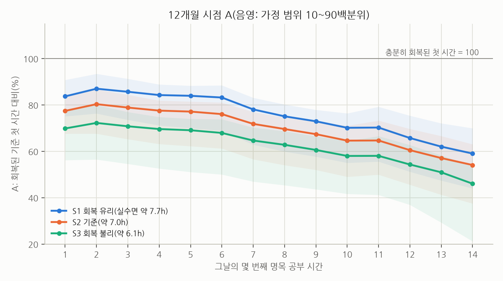
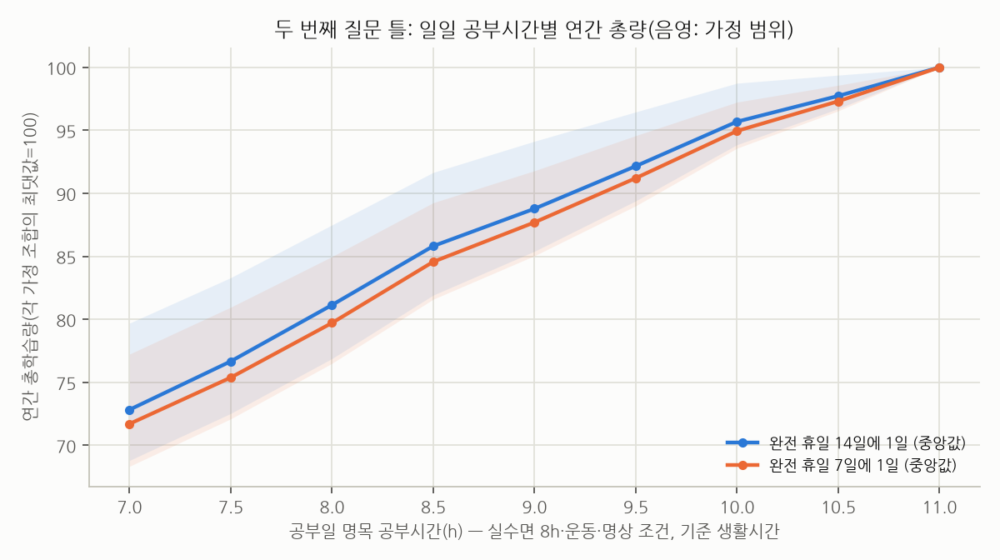

# 2부. 1년간 공부시간·휴일·여가 배분의 최적화

> 이 문서는 두 번째 질문(실수면 8시간, 주 150~300분 유산소 + 40~50분 근력, 하루 명상 30분, 공부 없는 식사, 매일 샤워와 잡무를 모두 지키는 조건)에 답해요. 시간별 추가 학습성과의 정의(R, A, RHE)와 모형은 [1부](01_시간별_학습효율.md)와 같아요. 모든 성과 수치는 **조건부 모형값**이고, 범위는 **가정 범위(10~90백분위)**이지 신뢰구간이 아니에요. 학습성과를 수능 점수로 바꾸지 않았어요.

---

## 1. 핵심 결론과 A/B 권장안

**먼저, 이 조건에서 하루 14시간 공부는 성립하지 않아요.** 실수면 8시간에는 침대 약 8.4~8.9시간이 필요하고, 식사·위생·운동(준비·샤워 포함)·명상·잡무·이동에 최소 2.9시간, 현실적으로 4.3시간 안팎이 들어요. 자유 여가를 0으로 해도 공부에 쓸 수 있는 시간은 2주 평균 **약 9.0~12.7시간(기준 가정 11.1시간)**이고, 14시간에는 하루 **1.4~5.0시간(기준 2.9시간)**이 모자라요. 운동하는 날만 보면 기준 가정의 한도는 10.75시간이에요(3-1절). 이 부족분은 수면이나 다른 조건을 깎아야만 메워져요(3절).

**두 번째로, 조건을 지키는 범위 안에서는 공부시간을 가능한 최대치 가까이 두는 쪽이 모형상 연간 총량이 가장 커요.** 이 범위에서는 수면이 보호되고, 늘어난 시간은 여가에서 나와요. 1부에서 보았듯이 여가에서 나온 공부시간은 시간당 효율이 낮아도 순증가였어요. 가정 조합의 95~99%에서 최적 일일 공부시간이 조건 안의 최대치(기준 생활 2주 평균 11시간)였어요. **다만 이건 모형 구조에서 거의 자동으로 나오는 결과예요.** 모형에서 여가의 효과는 누적 부하를 여가 1시간당 최대 6% 줄이는 경로 하나뿐이고(여가 회복 경로를 아예 꺼도 10시간 일정의 연간 총량이 약 1%만 줄어요), 같은 날 간섭이나 공고화 용량 한계 같은 경로는 없어요. 그래서 95~99%는 견고성의 근거가 아니라 분석자가 정한 가정 범위의 성질이에요. 독립 모형에서는 느린 누적 피로가 기준의 3~5배이거나 공부 1시간당 약 8%의 같은 날 간섭이 있으면 최적이 10~10.5시간으로 내려왔어요.

**세 번째로, 휴일과 여가를 늘리는 쪽이 이기려면 남은 공부일이 평균 약 8% 이상 좋아져야 해요.** 휴일 쪽은 효율 곡선과 무관한 산술이고, 여가 쪽은 모형 값이에요.

- 휴일을 14일에 1일에서 주 1일(14일에 2일)로 늘리면 공부일이 13일에서 12일로 줄어요. 연간 총량이 같으려면 남은 공부일의 하루 총량이 **+8.3%** 높아져야 해요(14일에 3일이면 +18.2%).
- 11시간을 10시간으로 줄여 자유 여가 1시간을 만들면, 남은 10시간이 평균 **+8.4%**(가정 범위 7.6~9.0%) 좋아져야 본전이에요(모형에서 11번째 시간이 하루 총량에서 차지하는 비중으로 계산).

휴식이 이만큼의 학습 향상을 만든다는 근거는 없고, 없다는 근거도 없어요. 확인된 효과는 대부분 직장인의 웰빙 지표이고 1~4주 안에 사라졌어요([de Bloom et al. 2009](https://doi.org/10.1539/joh.K8004); [Speth et al. 2024](https://doi.org/10.1027/1016-9040/a000518); [Kühnel & Sonnentag 2011](https://doi.org/10.1002/job.699)). 짧은 휴식은 피로감을 분명히 줄이지만 고난도 수행 향상은 유의하지 않았어요([Albulescu et al. 2022](https://doi.org/10.1371/journal.pone.0272460)). 그래서 **휴일·여가의 연간 총량상 가치는 모형이 정할 수 없고, 주로 소진·건강 악화·중도 포기 같은 꼬리 위험을 줄이는 보험으로 봐야 해요.** 학생 소진은 성취와 r=−0.24로 연관돼 있어요([Madigan & Curran 2021](https://doi.org/10.1007/s10648-020-09533-1)). 다만 상관 연구라 크기를 인과로 옮길 수 없어요.

### A/B 비교표

| 항목 | 시나리오 A: 성적 향상 최우선 | 시나리오 B: 기본 여가·휴일 보장 |
|---|---|---|
| 공부일 명목 공부시간 | **공부일 평균 약 11시간**(운동일 10.75시간, 비운동일 11.75시간). 11시간이 모형 최적이고, 10.5시간이면 약 2.3% 적어요(가정 범위 1~3%). 생활시간이 빠듯하면 평균 12.65시간, 넉넉하면 9시간이 상한이에요 | **공부일 평균 약 9.5시간**(운동일 9.25시간, 비운동일 10.25시간; 여가 하한 90분). 하한이 60분이면 평균 10시간, 120분이면 9시간이에요 |
| 예상 순공부시간 | 약 8.3시간(관여 비율 가정 70~90%에 따라 약 7.3~9.3시간) | 약 7.3시간(같은 가정으로 약 6.4~8.2시간. 하한 60분이면 7.7, 120분이면 6.9) |
| 완전 휴일 | 14일에 1일(격주 일요일), 월평균 약 2.2일. 질문의 13+1 일정을 하한으로 두었고, 휴일 0일은 권장 범위에서 뺐어요(5-2절) | 7일에 1일(매주 일요일), 월평균 약 4.3일 |
| 부분 휴식일 | 두지 않아요(모형 구조상 이득이 나오기 어려워요) | 두지 않아요 |
| 공부일 최소 자유 여가 | 따로 두지 않아요(운동일 0분, 비운동일 약 15분). 식사·운동·명상 시간이 공부하지 않는 시간으로 이미 확보돼 있어요 | 매일 90분 이상, 저녁의 연속 블록 1개(운동일 90분, 비운동일 약 104분) |
| 주간·연간 명목 공부시간 | 7일 평균 약 71.4시간, 연 약 3,720~3,730시간(시간표 기준과 모형의 평균 하루 기준) | 7일 평균 약 57시간, 연 약 2,970시간 |
| 주간·연간 순공부시간(가정값) | 7일 평균 약 54시간, 연 약 2,830시간 | 7일 평균 약 44시간, 연 약 2,270시간 |
| 연간 총량(RHE) | 3,231 (2,802~3,455) | 2,791 (2,505~2,938). A의 약 86%(가정 범위 83~91%) |
| 추천의 근거 수준 | 시간 예산 산술은 견고해요. "최대치가 최적"이라는 결론은 휴식·여가의 학습 효과가 작다는 가정에 기대요 | 여가 하한과 휴일 빈도는 과학이 아니라 생활 기준에 따른 선택이에요. 비용(B가 A보다 약 14% 적음)은 모형 추정값이에요 |
| 가장 중요한 조건과 실패 요인 | **실수면 8시간을 절대 공부로 바꾸지 않아야 하고**, 첫 2~4주 점검에서 후반 시간의 지연 기억이 유지돼야 해요. 실패 요인은 여가 0에 가까운 생활의 누적 소진, 운동·식사 시간이 공부로 잠식되는 것, 수면 시각이 밀리는 것이에요 | 여가를 실제 회복(심리적 분리)에 써야 하고, 휴일에 공부를 몰아서 하지 않아야 해요. 실패 요인은 여가 시간의 휴대폰 사용 등이 늦은 취침으로 이어지는 것, 휴일 늦잠으로 리듬이 흔들리는 것이에요 |

RHE는 "충분히 회복된 첫 1시간 몇 개분"의 연간 합계예요. 비교를 위한 상대 척도이고 성적 향상 폭이 아니에요. 지식이 쌓일수록 같은 1시간의 이득이 줄어드는 효과를 뺐기 때문에, 공부시간이 긴 일정의 우위 폭을 과대평가하는 쪽이에요(총량의 순위는 바뀌지 않아요).

**A와 B의 차이를 어떻게 읽어야 하나.** 모형 안에서 B는 A보다 연간 명목 공부시간이 20% 적지만 연간 총량은 약 14% 적어요(A가 B보다 약 16% 많음, 가정 범위 약 10~20%). 총량이 명목 공부시간만큼 줄지 않는 것은 주로 B에서 효율이 가장 낮은 10~11번째 시간과 그만큼의 누적 부하가 빠지기 때문이에요. 휴식·여가 자체의 회복 효과는 모형에서 약 1%p에 불과해요(회복 경로를 모두 꺼도 B/A가 0.864에서 0.851로 바뀌는 정도). 이 차이는 휴식의 학습 효과를 작게 본 가정과, 지식이 쌓일수록 시간당 이득이 줄어드는 효과를 뺀 RHE 척도(긴 일정에 유리)에서 나온 값이라, 실제 차이는 더 작을 수 있어요. 반대로 A의 여가 0에 가까운 생활이 몇 달 뒤 무너지는 위험은 모형에 들어 있지 않아요. 그래서 **"A는 모형 기준 B보다 연간 총량이 약 16% 많은 대신, 모형에 없는 소진 위험을 떠안는 선택"**으로 읽는 편이 정확해요.

---

## 2. 근거의 상태

**직접 알 수 있는 것(질문에 가까운 근거)**

- 실수면 8시간과 질문에서 정한 생활 조건을 함께 지키면 14시간 공부는 산술적으로 불가능해요(3절).
- 전업 시험 준비에서 하루 공부시간과 점수의 연관은 하루 8~11시간대 이후 평평해졌다는 관찰이 있어요([Kumar et al. 2015](https://pubmed.ncbi.nlm.nih.gov/25910497/), USMLE, 자기보고). GPA·MCAT 성적을 통제해도, 중복 없이 푼 문제 수가 많을수록 점수가 높았어요([Burk-Rafel et al. 2017](https://academic.oup.com/academicmedicine/article-abstract/92/Supplement_1/S67/8349111)). 이 연구가 보고한 시험 직전 전업 준비 기간의 하루 평균 11.0시간은 기술 통계일 뿐이고, 하루 공부시간이 점수를 예측하는지는 이번 검증에서 확인하지 못했어요.
- 한국 자료에서 재수생의 수능등급은 고3 대비 평균 0.75등급 올랐고, 자기주도 학습시간이 향상과 양의 연관을 보였어요([김양분 외 2014](https://www.kci.go.kr/kciportal/ci/sereArticleSearch/ciSereArtiView.kci?sereArticleSearchBean.artiId=ART001886532), 관찰 연구). KDI 분석에서는 혼자 공부하는 시간이 사교육 시간보다 수능 백분위와 더 강하게 연관됐어요(김희삼 2010·2011, 보도 경유). 둘 다 공부시간의 인과 효과나 최적 시간을 말해 주지는 않아요.

**간접 근거로 추정하는 것**

- 평소보다 잠을 줄이고 더 공부한 날의 다음 날에는 스스로 보고한 학업 곤란(수업 이해, 과제·시험)이 더 많았어요([Gillen-O'Neel et al. 2013](https://doi.org/10.1111/j.1467-8624.2012.01834.x), 고교생 일지, 개인 내 상관). 추가 공부로 얻은 학습량은 재지 않아서 순손익은 알 수 없어요.

- 하루 안의 시간 경과 효과(학교 시험, 긴 시험, 실험실 과제), 수면부채의 누적과 회복, 휴가·주말 회복의 소멸, 장시간 노동의 주간 산출 곡선([Pencavel 2015](https://doi.org/10.1111/ecoj.12166)). 노동 산출 연구는 즉시 산출이고 기억 유지가 아니라서, 방향 참고로만 썼어요.
- 운동의 직접 인지 효과는 작아요. 한 번 운동한 직후의 효과크기는 0.10이고([Chang et al. 2012](https://doi.org/10.1016/j.brainres.2012.02.068)), 장기 RCT 종합은 출판편향을 보정하면 효과크기 d=0.05였어요([Ciria et al. 2023](https://doi.org/10.1038/s41562-023-01554-4)). 수면에는 작은~중간 정도의 이득이 있어요([Kredlow et al. 2015](https://doi.org/10.1007/s10865-015-9617-6)). 운동을 학습 향상 수단으로 가정하지 않았고, 질문에서 정한 생활 조건으로만 반영했어요.
- 명상의 인지 효과도 작고(g=0.15, 작업기억 0.23), 활성 대조군보다 낫지 않았어요([Whitfield et al. 2022](https://doi.org/10.1007/s11065-021-09519-y)). 하루 30분이 10~15분보다 낫다는 근거는 찾지 못했어요.

**현재 정량적으로 확정할 수 없는 것**

- 휴일을 14일에 1일에서 7일에 1일로 늘릴 때의 학습상 순효과. 이걸 비교한 학습 연구가 없어요.
- 자유 여가 1시간의 학습상 가치(남은 공부의 효율을 몇 % 올리는가).
- 1년 동안의 소진·동기 저하가 연간 총량에 주는 영향의 크기.
- 하루 8시간 이후 시간당 효율의 정확한 모양(1부).
- 따라서 **A와 B의 성과 차이는 "모형 안에서 B가 A보다 약 14% 적고(A가 B보다 약 16% 많고), 휴식 효과가 크면 차이가 더 작다"까지만 말할 수 있어요.**

---

## 3. 24시간 및 주간 시간 예산 검증

### 3-1. 조건을 모두 지킬 때의 최대 공부시간

| 항목(공부일, 분) | 빠듯한 가정 | 기준 가정 | 여유 있는 가정 |
|---|---|---|---|
| 수면효율(실수면/침대) | 0.95 | 0.93 | 0.90 |
| 침대 시간(실수면 8h) | 8.42h | 8.60h | 8.89h |
| 식사 3끼(준비·정리 포함, 공부 없음) | 60 | 80 | 110 |
| 세면·샤워·옷차림 | 25 | 35 | 50 |
| 운동(주간 합계의 7일 평균, 준비·이동·샤워 포함) | 36 | 53 | 71 |
| 명상 | 30 | 30 | 30 |
| 생활 잡무 | 15 | 25 | 40 |
| 활동 간 전환·버퍼 | 10 | 15 | 25 |
| 공부 장소 왕복 | 0 | 20 | 40 |
| **수면·공부 외 합계(7일 평균)** | **2.93h** | **4.30h** | **6.11h** |
| 자유 여가 0분일 때 최대 명목 공부(7일 평균) | 12.65h | **11.10h** | 9.00h |
| 14h 대비 부족분(7일 평균) | 1.35h | **2.90h** | 5.00h |
| 운동 1회에 실제로 드는 시간(전환 포함) | 62분 | 74분 | 83분 |
| 여가 0분: 운동일 / 비운동일 최대 | 12.20 / 13.25h | **10.75 / 11.98h** | 8.81 / 10.19h |
| 여가 60분: 운동일 / 비운동일 최대 | 11.20 / 12.25h | 9.75 / 10.98h | 7.81 / 9.19h |
| 여가 90분: 운동일 / 비운동일 최대 | 10.70 / 11.75h | 9.25 / 10.48h | 7.31 / 8.69h |
| 여가 120분: 운동일 / 비운동일 최대 | 10.20 / 11.25h | 8.75 / 9.98h | 6.81 / 8.19h |

**7일 평균과 실제 하루는 달라요.** 운동은 매일 하지 않으므로, 운동하는 날에는 평균(53분)보다 많은 74분이 들고 운동하지 않는 날에는 0분이 들어요. 그래서 기준 가정에서 공부시간의 한도는 운동일 10.75시간, 비운동일 약 12시간이고, 2주 동안 평균하면 약 11시간이에요. 여가 하한을 "매일" 지키려면 운동일의 한도가 기준이 돼요.

- **수면**: 건강한 젊은 성인의 "좋은 수면" 기준이 잠드는 데 30분 미만, 효율 85% 초과, 중간 각성 20분 미만이에요([Ohayon et al. 2017](https://doi.org/10.1016/j.sleh.2016.11.006)). 젊은 성인의 실험실 수면효율 수치는 이번 검증에서 확인하지 못했어요. 수면효율이 10년마다 약 2.1%씩 낮아진다는 메타분석([Boulos et al. 2019](https://doi.org/10.1016/S2213-2600(19)30057-8))을 근거로, 20대는 0.90~0.95로 가정했어요. 침대 8시간은 실수면 8시간이 아니에요.
- **운동**: 기준 가정은 주 유산소 225분 + 근력 45분을 주 5회에 나누고, 회당 준비·이동·샤워 추가분 20분을 더한 값이에요(회당 약 54분 운동 + 20분). 유산소 150~300분은 WHO 권고 범위와 같아요([Bull et al. 2020](https://doi.org/10.1136/bjsports-2020-102955)). 근력 40~50분은 주 2일 이상으로 나누는 편이 흔히 인용되는 권고 형태에 맞아요(WHO 권고의 근력 운동 문구는 이번 검색에서 직접 확인하지 못했어요).
- **식사·위생·잡무·전환**: 통계청 생활시간조사의 국민 평균은 여유 있게 쓰는 시간을 포함하므로 상한 참고로만 썼어요(2024년 평균 수면이 보도에서는 8시간 4분, 일부 요약에서는 8시간 1분으로 달라 공식 표를 확인하지 못했고, 식사·개인유지 시간도 확인하지 못했어요). 현실적인 최소값은 분석자가 정한 가정이에요.
- **중복 계산 점검**: 공부 블록 안의 짧은 휴식과 화장실은 명목 공부시간에 포함되어 있어서 다시 더하지 않았어요. 운동과 명상은 공부시간으로 세지 않았어요. 걷기 통학을 운동으로 세고 싶다면, 그만큼 통학시간을 0으로 바꿔야 해요(한 활동을 두 범주에 동시에 넣지 않기 위해서예요).

### 3-2. 원래의 14시간 일정

실수면 8시간과 모든 조건을 지키면 기준 가정에서 하루 평균 2.9시간(운동일 3.25시간)이 모자라요. 이 부족분을 메우는 방식별 결과예요(연간 RHE, 기준 생활 가정, 평균적인 하루로 계산).

| 일정 | 실수면 | 어기는 조건 | 공부일 순공부시간 | 연간 명목 | 연간 RHE: 기준 (가정 범위) |
|---|---|---|---|---|---|
| 11h(조건 충족 최대, 2주 평균) | 8.0h | 없음(여가 약 0) | 8.3h | 3,729h | 3,231 (2,802~3,455) |
| 12h, 생활을 빠듯한 가정(2.9h)으로 | 8.0h | 없음. 식사 60분·통학 0분 등으로 압축 | 9.0h | 4,068h | 3,443 (2,986~3,681) |
| 12h, 수면을 줄여 맞춤 | 7.2h | 실수면 8h | 9.0h | 4,068h | 3,108 (2,630~3,354) |
| 14h, 수면을 줄여 맞춤 | 5.3h | 실수면 8h | 10.4h | 4,746h | 2,700 (1,717~3,078) |
| 14h, 운동·명상 생략 + 식사·위생 1.4h로 압축 | 8.0h | 운동·명상, 현실적 식사시간 | 10.4h | 4,746h | 3,735 (3,132~3,985) |

- **수면을 깎아 14시간을 만들면(실수면 5.3시간) 연간 총량이 11시간 일정보다 약 16% 적고**, 불리한 가정에서는 격차가 더 커져요(가정 범위 하단 1,717 RHE).
- **운동·명상을 버리고 식사·위생을 하루 1.4시간으로 줄이면** 모형상 총량이 11시간 일정보다 약 16% 많아요. 하지만 이 일정은 질문에서 제시한 조건을 어기고, 1년 동안 하루 식사·위생 1.4시간이 현실적인지 의문이에요. 운동을 1년 끊는 건강상 비용과 수면의 질 저하는 모형에 없어요. **권장안이 아니라 조건부 가상 분석**이에요.
- 생활시간을 빠듯하게(식사 60분, 통학 0분) 줄일 수 있다면 조건을 모두 지키면서 2주 평균 12.65시간(운동일 12.2시간)까지 가능해요. 모형으로 계산한 12시간 일정은 11시간 일정보다 연간 총량이 약 6.5% 많아요. **이 모형에서는 A의 공부시간을 피로 곡선보다 생활시간 예산이 정해요.**

### 3-3. 시나리오 A의 대표 공부일

2주(14일) 동안 공부일 13일 중 운동일 10일은 **10.75시간**, 비운동일 3일은 **11.75시간**으로 두면 공부일 평균이 약 11.0시간이에요(2주 합계 142.75시간). 아래는 운동일이에요.

| 시각 | 활동 | 분류 |
|---|---|---|
| 06:40–06:55 | 기상, 세면·옷 | 위생 |
| 06:55–07:15 | 아침 식사(공부 없음) | 식사 |
| 07:15–07:25 | 공부 장소로 이동 | 이동 |
| 07:25–11:55 | **블록 1 (4시간 30분)**: 고난도 문제풀이·새 개념. 50분 공부 + 5~10분 휴식 단위 | 명목 공부 |
| 11:55–12:25 | 점심 | 식사 |
| 12:25–16:10 | **블록 2 (3시간 45분)**: 과목 전환, 문제풀이와 강의(필요하면 1.5~2배속) | 명목 공부 |
| 16:10–17:24 | 운동 + 이동·샤워(74분 틀). 월·수·금은 유산소 40분 + 근력 15분, 화·목은 유산소 45분(주 유산소 210분, 근력 45분) | 운동 |
| 17:24–17:54 | 저녁 | 식사 |
| 17:54–20:24 | **블록 3 (2시간 30분)**: 인출 복습·오답 재풀이·암기 확인 | 명목 공부 |
| 20:24–20:34 | 귀가 | 이동 |
| 20:34–20:59 | 잡무·다음 날 준비 | 잡무 |
| 20:59–21:19 | 세면·샤워 | 위생 |
| 21:19–21:49 | 명상 | 명상 |
| 21:49–22:04 | 전환·취침 준비 | 버퍼 |
| 22:04–06:40 | 침대 8시간 36분(실수면 약 8시간 목표) | 수면 |

명목 공부 645분 = 10.75시간, 생활 279분, 침대 516분으로 합계 1,440분이에요. 운동일의 자유 여가는 0이에요. **운동하지 않는 날**은 운동 74분 중 60분을 블록 2에 붙여(12:25–17:10) 11.75시간을 공부하고, 남는 약 15분은 여유로 둬요.

오전 블록을 수능 시작 시각(08:40)에 걸치게 둔 것은 실제 시험 시간대에 맞춘 연습을 하려는 의도예요. 시각 배치는 생활 설계상의 선택이지 생물학적 최적값이 아니에요.

### 3-4. 시나리오 B의 대표 공부일(여가 90분 이상)

2주 동안 공부일 12일, 완전 휴일 2일이에요. 운동 10회 중 9회는 공부일에, 1회는 휴일에 해요. 운동일 9일은 **9.25시간**, 비운동일 3일은 **10.25시간**으로 두면 공부일 평균이 9.5시간이에요(2주 합계 114시간). 아래는 운동일이에요.

| 시각 | 활동 |
|---|---|
| 06:40–07:25 | 기상, 세면, 아침, 이동 |
| 07:25–11:55 | **블록 1 (4시간 30분)** |
| 11:55–12:25 | 점심 |
| 12:25–15:25 | **블록 2 (3시간)** |
| 15:25–16:39 | 운동 + 이동·샤워 |
| 16:39–17:09 | 저녁 |
| 17:09–18:54 | **블록 3 (1시간 45분)**: 인출 복습 |
| 18:54–19:04 | 귀가 |
| 19:04–20:34 | **자유 여가 (1시간 30분)**: 공부 밖으로 완전히 분리되는 활동 |
| 20:34–20:59 | 잡무 |
| 20:59–21:19 | 세면·샤워 |
| 21:19–21:49 | 명상 |
| 21:49–22:04 | 전환·취침 준비 |
| 22:04–06:40 | 침대 8시간 36분 |

명목 공부 555분 = 9.25시간, 생활 279분, 여가 90분, 침대 516분으로 합계 1,440분이에요. **운동하지 않는 날**은 운동 74분 중 60분을 블록 2에 붙여 10.25시간을 공부하고, 여가는 약 104분이 돼요. 여가 60분 하한이면 운동일 9.75·비운동일 10.75시간(평균 10.0시간), 120분 하한이면 8.75·9.75시간(평균 9.0시간)이에요.

**모형과 시간표의 관계**: 연간 RHE는 운동일·비운동일을 나누지 않은 "평균적인 하루"(기상 06:30, 블록 비율 0.34/0.38/0.28, 식사 약 36분)로 계산했어요. 위 시간표는 같은 주간 공부시간을 실제 하루에 배치한 예시예요. 블록 길이가 달라지면 블록 피로와 식사 회복 효과가 조금 달라지지만, 연간 총량의 차이는 모형 해상도(약 1%) 안으로 봐요.

### 3-5. 주간 예산

| 항목 | A(14일 중 13일 공부) | B(14일 중 12일 공부) |
|---|---|---|
| 명목 공부 | 2주 142.75시간(7일 평균 약 71.4시간) | 2주 114시간(7일 평균 57시간) |
| 실수면 | 공부일 8시간, 휴일 밤 약 9시간(모형 가정: 휴일 밤 +1시간) | 같음 |
| 유산소 + 근력 | 주 225분 + 45분(주 5회, 모두 공부일) | 같은 양, 2주 10회 중 1회는 휴일 |
| 명상 | 주 210분 | 같음 |
| 공부일 자유 여가 | 운동일 0분, 비운동일 약 15분 | 매일 90분 이상(운동일 90분, 비운동일 약 104분), 저녁의 연속 블록 |
| 완전 휴일 | 14일에 1일(월평균 약 2.2일) | 7일에 1일(월평균 약 4.3일) |

---

## 4. 1~14번째 시간의 추가 학습성과 표

값은 조건부 모형값이고 5% 단위로 반올림했어요. 괄호는 가정 범위(10~90백분위)예요. 모두 "평균적인 하루"(3-4절 참고)로 계산했어요.

### 4-1. 시나리오 A(공부일 평균 11시간)의 시간별 추가 학습성과

| 몇 번째 시간 | 초기 1~2주 R | 6개월 R | 12개월 R | 초기 1~2주 A | 6개월 A | 12개월 A |
|---|---|---|---|---|---|---|
| 1 | 100 | 100 | 100 | 90 (85~95) | 90 (85~100) | 90 (85~100) |
| 2 | 105 (95~105) | 105 (95~110) | 105 (95~110) | 90 (85~100) | 95 (85~100) | 95 (85~100) |
| 3 | 105 (95~105) | 105 (95~105) | 105 (95~105) | 90 (80~100) | 95 (85~100) | 95 (85~100) |
| 4 | 105 (90~105) | 105 (90~105) | 105 (90~105) | 90 (80~95) | 95 (80~100) | 95 (80~100) |
| 5 | 105 (90~105) | 105 (90~105) | 105 (90~105) | 90 (80~100) | 95 (80~100) | 95 (80~100) |
| 6 | 100 (85~100) | 100 (85~100) | 100 (85~100) | 85 (75~95) | 90 (75~95) | 90 (75~95) |
| 7 | 95 (80~100) | 95 (80~100) | 95 (80~100) | 80 (70~90) | 85 (70~90) | 85 (70~90) |
| 8 | 90 (75~95) | 90 (75~95) | 90 (75~95) | 80 (65~85) | 80 (65~90) | 80 (65~90) |
| 9 | 95 (80~100) | 95 (80~100) | 95 (80~100) | 80 (70~90) | 85 (70~90) | 85 (70~90) |
| 10 | 85 (70~95) | 85 (70~95) | 85 (70~95) | 75 (65~85) | 80 (65~85) | 80 (65~85) |
| 11 | 80 (65~90) | 85 (65~90) | 85 (70~90) | 75 (60~80) | 75 (60~85) | 75 (60~85) |

- 실수면 8시간이 지켜지므로 첫 시간 A가 90 안팎으로, 수면이 부족한 14시간 일정(1부 S2의 약 75)보다 높아요.
- 9번째 시간이 8번째보다 높은 것은 운동·저녁 식사 뒤 블록 피로가 회복되기 때문이에요(일시적 저하와 회복). 11번째 시간은 첫 시간의 약 80~85%, 회복된 첫 시간의 약 75%예요.

### 4-2. 시나리오 B(공부일 평균 9.5시간)의 시간별 추가 학습성과

| 몇 번째 시간 | 초기 1~2주 R | 6개월 R | 12개월 R | 초기 1~2주 A | 6개월 A | 12개월 A |
|---|---|---|---|---|---|---|
| 1 | 100 | 100 | 100 | 90 (85~95) | 95 (90~100) | 95 (90~100) |
| 2 | 105 (95~105) | 105 (95~110) | 105 (95~110) | 95 (85~100) | 100 (90~105) | 100 (90~105) |
| 3 | 105 (95~105) | 105 (95~105) | 105 (95~105) | 95 (85~100) | 100 (90~105) | 100 (90~105) |
| 4 | 105 (95~110) | 105 (95~110) | 105 (95~110) | 95 (85~100) | 100 (90~105) | 100 (90~105) |
| 5 | 100 (90~105) | 100 (90~105) | 100 (90~105) | 95 (85~100) | 100 (85~105) | 100 (85~105) |
| 6 | 100 (85~100) | 100 (85~100) | 100 (85~100) | 90 (80~95) | 95 (80~100) | 95 (80~100) |
| 7 | 95 (80~100) | 95 (80~100) | 95 (80~100) | 85 (75~90) | 90 (75~95) | 90 (75~95) |
| 8 | 95 (80~100) | 95 (80~100) | 95 (85~100) | 90 (75~95) | 90 (80~100) | 90 (80~100) |
| 9 | 90 (75~95) | 90 (80~95) | 90 (80~95) | 85 (70~90) | 85 (75~95) | 85 (75~95) |
| 10 (마지막 30분, 1시간당 환산) | 90 (75~95) | 90 (75~95) | 90 (75~95) | 80 (65~85) | 85 (70~90) | 85 (70~90) |

- B는 누적 부하가 적어서 6개월 이후 첫 시간 A가 약 95예요. 마지막 30분은 1시간당으로 환산했어요.

### 4-3. 경계 사례: 실수면 8시간을 지킨 14시간 가상 일정(운동·명상 생략, 식사·위생 1.4시간)

두 번째 질문 조건에서 14시간은 불가능하므로, 수면을 지키고 다른 조건을 어긴 **가상 일정**으로 계산했어요. 권장안이 아니라, 조건을 깨면 시간별 모양이 어떻게 되는지 보여 주는 경계 사례예요. 수면이 부족한 현실적 14시간 일정(S1~S3)은 [1부 C절](01_시간별_학습효율.md#c-핵심-시간별-예측표)에 있어요.

| 몇 번째 시간 | 초기 1~2주 R | 6개월 R | 12개월 R | 초기 1~2주 A | 6개월 A | 12개월 A |
|---|---|---|---|---|---|---|
| 1 | 100 | 100 | 100 | 85 (80~90) | 85 (80~95) | 85 (80~95) |
| 2 | 105 (95~105) | 105 (95~105) | 105 (95~105) | 90 (80~95) | 90 (80~95) | 90 (80~95) |
| 3 | 105 (95~105) | 105 (95~105) | 105 (95~105) | 90 (75~95) | 90 (80~95) | 90 (80~95) |
| 4 | 100 (90~105) | 100 (90~105) | 100 (90~105) | 85 (75~90) | 90 (75~95) | 90 (75~95) |
| 5 | 100 (90~105) | 100 (90~105) | 100 (90~105) | 85 (75~90) | 90 (75~90) | 90 (75~90) |
| 6 | 100 (85~105) | 100 (85~105) | 100 (85~105) | 85 (70~90) | 85 (70~90) | 85 (70~90) |
| 7 | 95 (80~100) | 95 (80~100) | 95 (80~100) | 80 (65~85) | 80 (65~85) | 80 (65~85) |
| 8 | 90 (75~95) | 90 (75~95) | 90 (75~95) | 75 (60~80) | 80 (60~85) | 80 (60~85) |
| 9 | 85 (70~95) | 85 (70~90) | 85 (70~95) | 75 (60~80) | 75 (60~80) | 75 (60~80) |
| 10 | 85 (70~90) | 85 (70~90) | 85 (70~90) | 70 (55~80) | 75 (60~80) | 75 (60~80) |
| 11 | 85 (70~95) | 85 (70~90) | 85 (70~90) | 70 (60~80) | 75 (60~80) | 75 (60~80) |
| 12 | 80 (65~90) | 80 (65~90) | 80 (65~90) | 65 (55~75) | 70 (55~75) | 70 (55~80) |
| 13 | 75 (60~85) | 75 (60~85) | 75 (60~85) | 65 (50~70) | 65 (50~75) | 65 (50~75) |
| 14 | 70 (55~80) | 70 (55~80) | 70 (55~80) | 60 (45~70) | 60 (45~70) | 60 (45~70) |

- 수면이 보호되면 **하루 안의 모양(R)은 수면이 부족한 일정과 거의 같고, 수준(A)이 약 10점 높아요**(1부 S2의 12개월 첫 시간 A 약 75 대 이 가상 일정의 약 85~90).
- 80% 교차는 기준 가정에서 여전히 12번째 시간이에요. 가정 범위는 7번째부터 "14시간 안에 없음"까지 걸쳐요.
- 초기·6개월·12개월 사이의 차이는 5% 단위 안이에요. 모형은 수면이 보호된 일정에서 연중 악화를 거의 만들지 않았어요. 초기 1~2주의 A가 조금 낮은 것은 일정 적응을 가정했기 때문이에요.

### 4-4. 수치의 성격

- 5번째 시간까지의 평탄함은 긴 시험 연구와 학교 하루 연구가 지지하는 간접 추정이에요.
- 7~11번째 시간의 점진적 저하와 12번째 이후의 가속은 **분석자가 선택한 누적 피로 곡선의 결과**예요. 이 곡선의 모양을 정할 실증 자료가 없어서, 모양 지수를 1(초반부터 떨어지는 오목형)~4(후반 가속)로 바꿔 가며 범위를 냈어요. 독립 모형 M3에서는 곡선 모양만 바꿔도 80% 교차가 6번째부터 "14시간 안에 없음"까지 움직였어요.
- 수면·휴일 효과의 크기는 수면제한 메타분석과 휴가 연구에서 빌린 간접 추정이고, PVT·웰빙 지표를 학습으로 옮기는 비율은 가정이에요.

---

## 5. 연간 최적화 결과와 민감도 분석

### 5-1. 8·10·12·14시간 비교(두 번째 질문의 조건)

| 공부일 명목 | 가능 여부(기준 생활 4.3h) | 공부일 여가 | 공부일 순공부시간 | 연간 RHE: 기준 (가정 범위) | 11h 대비 |
|---|---|---|---|---|---|
| 8h | 가능 | 3.1h | 6.2h | 2,643 (2,368~2,747) | 약 82% |
| 10h | 가능 | 1.1h | 7.7h | 3,090 (2,739~3,295) | 약 96% |
| 11h | 가능(최대) | 0.1h | 8.3h | 3,231 (2,802~3,455) | 100% |
| 12h | 기준 생활로는 불가능. 빠듯한 생활(2.9h)이면 가능 | 0.7h | 9.0h | 3,443 (2,986~3,681) | 약 107% |
| 14h | 불가능해요. 수면을 5.3h로 깎거나 운동·명상과 현실적 식사시간을 버려야 해요 | 0h | 10.4h | 2,700 또는 3,735(3-2절) | 약 84% 또는 116% |

**불가능한 일정은 가능한 일정과 같은 선택지로 순위를 매기지 않았어요.** 14시간의 두 값은 서로 다른 조건 위반의 결과라서 비교 대상이 아니라 경계 사례예요.

**증가분**(기준 생활, 휴일 14일에 1일): 8→10시간 +447 RHE(+17%), 10→11시간 +142(+4.6%). 두 번째 질문 조건에서는 늘어난 시간이 여가에서 나오므로 수면 경로의 손실이 없어요. 대신 여가가 사라지는 비용은 모형 안에서 작게만 반영돼요.

### 5-2. 휴일 빈도와 부분 휴식일

| 비교(같은 공부일 시간) | 연간 총량 비율: 중앙값 (가정 범위) | 대안이 더 나은 가정 조합 |
|---|---|---|
| 11h: 휴일 7일에 1일 대 14일에 1일 | 0.95 (0.93~0.96) | 0% |
| 11h: 휴일 14일에 3일 대 1일 | 0.88 (0.86~0.91) | 0% |
| 10h: 휴일 7일에 1일 대 14일에 1일 | 0.94 (0.93~0.95) | 0% |
| 11h: 반일 휴식일 추가(14일에 1일) 대 없음 | 0.98 | 3% |
| 참고: 11h에서 휴일 0일 대 14일에 1일(탐색 범위 밖) | 1.05 (1.01~1.06) | 모형상 대부분 |

모형 안에서는 휴일을 늘리는 쪽이 이기는 가정 조합이 없었어요. 같은 이유로 휴일을 아예 없애면 모형상 연간 총량이 약 5% 늘어요. 하지만 이 모형에는 소진·질병·중도 포기 같은 급격한 실패가 없어서, 휴일을 줄이는 쪽이 항상 이기게 되어 있어요. 그래서 권장안에서는 질문에서 정한 "14일에 1일"을 하한으로 두고 휴일 0일은 탐색 범위에서 뺐어요. 이건 모형 결과가 아니라 모형이 다루지 못하는 위험에 대한 판단이에요. 1절의 손익분기(+8.3%)를 넘을 만큼 휴일 하루가 이후 공부일을 끌어올리는 가정 조합이 모형의 가정 범위 안에 없었다는 뜻이에요. **이 결과는 휴일의 학습 효과를 작게 본 가정 범위 자체에서 나온 것**이라서, "휴일은 쓸모없다"는 증거가 아니에요. 같은 휴일 수라도 매주 분산하는 것과 몰아서 쉬는 것의 효과는 다를 수 있는데, 휴가 효과가 1~4주 안에 사라진다는 직장인 연구에 비추면, 휴일은 몰아 쓰기보다 규칙적으로 나누는 편이 회복 효과를 유지하는 데 나을 것으로 봐요. 다만 두 방식을 직접 비교한 연구는 찾지 못했어요.

### 5-3. 여가 하한에 따른 비용(시나리오 B)

| B의 조건 | 최적 공부일 시간 | 순공부시간 | 연간 RHE | A(11h, 휴일 14일에 1일) 대비: 중앙값 (가정 범위) |
|---|---|---|---|---|
| 여가 60분 + 주 1회 휴일 | 10h | 7.7h | 2,904 | 0.90 (0.87~0.94) |
| **여가 90분 + 주 1회 휴일(대표)** | **9.5h** | **7.3h** | **2,791** | **0.86 (0.83~0.91)** |
| 여가 120분 + 주 1회 휴일 | 9h | 6.9h | 2,687 | 0.83 (0.79~0.88) |

**B의 여가 하한을 90분으로 둔 이유**: 하루 한 번은 식사나 운동과 별개로, 공부에서 완전히 떨어지는 연속된 시간이 있어야 한다는 생활 기준이에요. 회복 연구에서 피로와 가장 강하게 연결된 것은 일에서 심리적으로 분리되는 경험이었어요([Bennett et al. 2018](https://doi.org/10.1002/job.2217)). 90분은 영화 한 편, 긴 산책, 친구와의 저녁 한 끼가 들어가는 길이예요. 과학이 정한 값이 아니라 선택이고, 60분이나 120분으로 바꾸면 비용이 위 표처럼 약 3~4%p씩 움직여요. 주 1회 완전 휴일도 같은 성격의 선택이에요. 주 6일 48시간 근무의 주간 산출이 주 7일 70시간보다 약간 많았다는 공장 자료([Pencavel 2015](https://doi.org/10.1111/ecoj.12166), 보도자료 경유)가 방향상 참고가 되지만, 학습 연구는 아니에요.

### 5-4. 결과를 좌우하는 핵심 가정과 견고성

| 추천 | 가정이 바뀌어도 유지되는가 | 이유 |
|---|---|---|
| 실수면 8시간 조건에서 14시간은 불가능 | **유지** | 시간 산술이에요. 가장 빠듯한 생활에서도 2주 평균 1.4시간이 부족해요 |
| 수면을 깎아 공부시간을 늘리지 말 것 | **방향은 유지, 부호는 미확정** | 1부의 12→14 비교에서 네 모형 모두 순효과가 0 근처이거나 음수였고(통합 모형은 84% 조합이 음수), 개인 내 일지 연구와 방향이 같아요. 두 번째 질문 조건에서 수면을 5.3시간으로 깎는 14시간은 11시간 일정보다 통합 모형에서 16% 적고, 수면을 깎아 12→14시간으로 늘리는 단계는 M3에서 조합의 90%가 손실이었어요 |
| A의 공부시간 ≈ 조건 안의 최대치(기준 11시간) | **모형 구조에 의존** | 가정 조합의 95~99%에서 최적이 최대치지만, 여가·휴식의 학습 효과가 작고 같은 날 간섭이 없다는 모형 구조에서 거의 자동으로 나와요. 소진·중도 포기 같은 급격한 실패도 모형에 없어요. 여가 1시간이 남은 시간을 약 8%(가정 범위 약 6~9%) 넘게 끌어올리거나 시간당 약 8%의 간섭이 있으면 결론이 뒤집혀요 |
| A의 최적 공부시간 자체의 숫자 | **생활시간 예산에 민감** | 2주 평균으로 빠듯하면 약 12.5시간, 기준이면 11시간, 넉넉하면 9시간이에요. 피로 모수보다 생활 예산이 먼저 정해요 |
| 휴일 14일에 1일이 7일에 1일보다 총량이 큼 | **모형 안에서만 유지** | 휴일의 학습 효과를 직접 잰 근거가 없어요. 손익분기는 +8.3%예요 |
| B의 비용(B가 A보다 약 14% 적음) | **가정에 민감** | 휴식 효과를 작게 본 가정과 긴 일정에 유리한 척도(RHE)의 결과예요. 휴식 효과가 크면 비용이 줄어요 |

독립적으로 만든 다른 모형들과의 비교는 [4부](04_방법과_검증.md)에 있어요.

---

## 6. 실제 운영안

### 6-1. 휴일 운영과 2주 단위 배치

- **A**: 1~13일째 공부, 14일째 완전 휴일. 2주 중 하루(예: 7일째)는 실제 수능 시간표에 맞춘 전 과목 모의고사 날로 운영해요.
- **B**: 6일 공부 + 1일 완전 휴일을 두 번 반복해요. 모의고사는 2주에 한 번, 휴일 전날에 두면 채점·오답 정리를 공부일 안에 끝내기 좋아요.
- **모의고사 날의 시간표**(2027학년도 시행기본계획의 시간 기준): 06:40 기상 → 08:10까지 자리 정리 → 08:40–10:00 국어 → 10:30–12:10 수학 → 12:10–13:00 점심 → 13:10–14:20 영어 → 14:50–16:37 한국사·탐구(제2외국어·한문을 보면 17:45까지) → 운동 → 저녁 → 약 2시간 채점·오답 정리 → 평소처럼 22:04 취침. 시험 사이 쉬는 시간을 명목 공부시간에 넣어 세면 이날 명목 공부는 약 10시간으로, 평소 운동일보다 약 45분 적어요. 2028학년도에는 통합사회·통합과학이 각각 25문항 40분이라, 새 시험 체제가 확정·공개되면 4교시 시간을 그에 맞춰요.
- **완전 휴일의 원칙**: 계획된 공부를 하지 않아요. 복습을 조금이라도 하면 "부분 휴식일"로 따로 기록해요. 기상 시각은 평소와 1시간 넘게 차이 나지 않게 하고(휴일 늦잠이 다음 날 리듬을 흔드는 것을 막기 위해), 실수면은 평소보다 조금 더 길어도 괜찮아요. 5시간 이하로 며칠 수면을 제한한 뒤에는 2~3일의 회복 수면으로도 일부 지표가 기준선으로 돌아오지 않았어요([Belenky et al. 2003](https://doi.org/10.1046/j.1365-2869.2003.00337.x)의 3·5시간군; [Lo et al. 2016](https://pmc.ncbi.nlm.nih.gov/articles/PMC4763363)). 그래서 평일의 부족을 휴일에 몰아 자서 갚는 설계는 피해요.

**2주(14일) 일정표**(1일째를 월요일로 둔 예시)

| 일차 | 요일 | A: 날 유형 / 명목 공부 | B: 날 유형 / 명목 공부 |
|---|---|---|---|
| 1 | 월 | 운동일(유산소+근력) / 10.75h | 운동일(유산소+근력) / 9.25h |
| 2 | 화 | 운동일(유산소) / 10.75h | 운동일(유산소) / 9.25h |
| 3 | 수 | 운동일(유산소+근력) / 10.75h | 운동일(유산소+근력) / 9.25h |
| 4 | 목 | 운동일(유산소) / 10.75h | 운동일(유산소) / 9.25h |
| 5 | 금 | 운동일(유산소+근력) / 10.75h | 운동일(유산소+근력) / 9.25h |
| 6 | 토 | 비운동일 / 11.75h | 비운동일 / 10.25h |
| 7 | 일 | 비운동일·모의고사 날 / 약 10h | **완전 휴일**(운동 없음) |
| 8 | 월 | 운동일(유산소+근력) / 10.75h | 운동일(유산소+근력) / 9.25h |
| 9 | 화 | 운동일(유산소) / 10.75h | 운동일(유산소) / 9.25h |
| 10 | 수 | 운동일(유산소+근력) / 10.75h | 운동일(유산소+근력) / 9.25h |
| 11 | 목 | 운동일(유산소) / 10.75h | 운동일(유산소) / 9.25h |
| 12 | 금 | 운동일(유산소+근력) / 10.75h | 비운동일 / 10.25h |
| 13 | 토 | 비운동일 / 11.75h | 비운동일·모의고사 날 / 약 10h |
| 14 | 일 | **완전 휴일** | **완전 휴일**(운동 1회: 유산소 40분 + 근력 15분) |
| 합계 | | 공부 약 141시간, 운동 10회 | 공부 약 114시간, 운동 10회(휴일 1회 포함) |

A의 2주 합계는 모의고사 날 때문에 3-3절의 142.75시간보다 약 2시간 적어요. B는 두 번째 주 금요일 운동을 휴일(14일째)로 옮겨 운동 10회를 맞췄어요. 근력 운동은 이틀 연속이 되지 않게 월·수·금(B는 두 번째 주 금요일 대신 일요일)에 두었어요. 두 안 모두 2주에 유산소 420분(주 210분)과 근력 90분(주 45분)이라 질문 조건(주 유산소 150~300분, 근력 40~50분) 안에 있어요.

**연간 달력 배치**

- **A**: 격주 일요일이 완전 휴일이라 1년에 26일, 달마다 2~3일이에요. **B**: 매주 일요일이라 1년에 52일, 달마다 4~5일이에요.
- **고정 일정에 맞춘 이동 규칙**: 평가원 6월·9월 모의평가, 설·추석 연휴처럼 날짜가 정해진 일정이 있는 주에는 휴일을 그 일정 다음 날이나 명절 당일로 옮기되, 14일 주기를 이틀 넘게 밀지 않아요. 2027년 모의평가 날짜는 평가원 공지로 확인해야 해요(이 보고서 작성 시점에는 확인하지 않았어요).
- **시험 직전 2주**: 휴일 리듬과 기상 시각은 그대로 두고, 모의고사 날을 실제 시험 시간표에 맞춰요. 시험이 다가왔다고 수면을 줄이는 것은 1부의 결론과 반대 방향이에요.
- 이 배치는 생활 설계상의 선택이지, 특정 요일이나 날짜가 학습에 유리하다는 근거가 있는 것은 아니에요.

### 6-2. 같은 시간의 학습성과를 높이는 배치

- **강의와 직접 풀이의 비율**: 강의는 새 개념이 필요할 때로 한정하고, 1.5~2배속까지는 지연 이해 손실이 작았어요([Murphy et al. 2022](https://doi.org/10.1002/acp.3899)). 절약한 시간은 인출·문제풀이로 돌려요. 강의 중간에 스스로 퀴즈를 넣으면 마음 방황이 줄었어요([Szpunar et al. 2013](https://doi.org/10.1073/pnas.1221764110)).
- **복습 간격과 오답 처리**: 시험이 수개월 뒤라면 복습 간격은 며칠이 아니라 수 주 단위가 맞아요(시험까지 1년이 남았다면 최적 복습 간격은 그 기간의 약 5~10%, 곧 약 3~5주예요. [Cepeda et al. 2008](https://eric.ed.gov/?id=ED505660)). 틀린 문제는 당일, 약 1주 뒤, 약 3~4주 뒤에 다시 풀어요. 같은 유형 문제를 한 번에 더 많이 푸는 과잉학습(9문제 대 3문제)은 1주·4주 뒤 모두 이득이 없었어요([Rohrer & Taylor 2006](https://doi.org/10.1002/acp.1266)).
- **수학**: 1개월 뒤 시험 정답률이 유형을 섞어 푼 집단 61%, 유형별로 몰아 푼 집단 38%였어요([Rohrer et al. 2020](https://psycnet.apa.org/record/2019-26066-001)). 다만 대규모 적용 연구에서는 효과가 g=0.18로 경계 수준이었다는 보고도 있어요(ACM Learning@Scale 2025 발표, 조사 단계 확인).
- **일중 배치**: 오전 블록에 고난도 문제풀이와 새 개념, 오후에 과목 전환, 저녁 블록에 인출 복습·오답·암기 확인을 두어요. 늦은 시간의 위험은 "배울 수 없음"보다 "쉬운 방식으로 빠지는 것"일 수 있어서(하루 분량의 고난도 작업 뒤 저노력·단기 선택 증가: [Wiehler et al. 2022](https://pubmed.ncbi.nlm.nih.gov/35961314/); 즉시 보상 선호 증가: [Blain et al. 2016](https://doi.org/10.1073/pnas.1520527113); 공부에서 직접 검증된 것은 아님), 저녁 블록의 할 일을 미리 구체적인 인출 과제로 정해 두는 편이 나아요.
- **블록과 휴식**: 스스로 쉴 때를 정하면 블록이 길어지고 피로가 늘었어요([Biwer et al. 2023](https://doi.org/10.1111/bjep.12593)). 25분, 50분처럼 계획된 휴식 단위를 쓰되, 특정 길이가 정답이라는 근거는 없어요. 학교 시험 연구(아동)에서 20~30분 휴식은 1시간 경과에 따른 점수 저하보다 큰 폭으로 점수를 되돌렸어요([Sievertsen et al. 2016](https://doi.org/10.1073/pnas.1516947113)). 공부 블록에서의 회복 비율(모형의 75%)은 가정이에요.
- **낮잠**: 조건상 수면 8시간을 밤에 채우는 설계라 낮잠을 넣지 않았어요. 전날 약 5시간만 잔 조건의 실험에서 10분 낮잠은 곧바로 각성·수행을 올렸고 효과가 약 155분 지속됐어요. 20분 낮잠은 깬 뒤 약 35분이 지나서야 효과가 나타났고, 30분 낮잠은 직후 수면관성이 있었어요([Brooks & Lack 2006](https://doi.org/10.1093/sleep/29.6.831); 20·30분 결과는 초록 수준에서 확인했어요). 30분 낮잠이 부호화에 이로웠다는 연구도 있어요([Leong et al. 2023](https://academic.oup.com/sleep/article/46/4/zsad025/7034889)). 낮잠 시간은 공부시간이 아니라 수면·생활시간에서 가져와야 해요.
- **운동 시각**: 저녁 운동은 대체로 수면을 해치지 않지만, 취침 1시간 이내에 끝나는 격렬한 운동은 피해요([Stutz et al. 2019](https://doi.org/10.1007/s40279-018-1015-0)).

### 6-3. 연중 조정 원칙

1. **수면은 고정 변수예요.** 공부량을 조정할 때는 공부시간과 여가를 움직이고, 수면은 건드리지 않아요.
2. **초반(1~2개월)**: 2028학년도 수능 체제라면 통합사회·통합과학이 각각 25문항 40분으로 모두 필수이고, 수학은 대수·미적분Ⅰ·확률과 통계예요([교육부·평가원 2025.1.21 안내](https://www.togetherschool.go.kr/playGround/policyNotification/detailView?pstId=52803)). 예전 체제로 공부한 재수생은 새 범위를 배워야 하므로, 초반에는 새 개념의 비중이 커요.
3. **중반**: 인출·문제풀이 비중을 늘리고, 2주 단위 모의고사로 추세를 봐요.
4. **마지막 2~3개월**: 실제 시험 시간표(08:40 시작, 4교시 16:37 종료)에 맞춘 연습을 늘리고, 새 내용보다 인출·오답 반복의 비중을 키워요. 시험이 가까워졌다고 수면을 줄이는 것은 1부의 결론과 반대 방향이에요.
5. **몇 주 이상 지표가 나빠지면** 공부시간을 0.5시간 줄이거나, 휴일을 한시적으로 주 1회로 바꿔요. 되돌리는 것은 2주 뒤 지표로 판단해요.

### 6-4. 첫 2~4주 개인화 점검 절차

이 절차는 수면을 실험 변수로 쓰지 않아요. 실수면 8시간과 생활 조건을 유지한 채, 공부시간과 회복 배분만 조정해요.

**시작 수준과 일정**

- **1~2주차(기준선·적응)**: A는 운동일 10.25시간·비운동일 11.25시간, B는 운동일 8.75시간·비운동일 9.75시간처럼 목표보다 0.5시간 낮게 시작해요. 이 기간에는 공부시간을 바꾸지 않고 기록만 해요. 모형도 처음 약 3주는 일정 적응으로 효율이 낮다고 가정했으니, 이 기간의 지표로 판단하지 않아요.
- **2주차 끝**: 실제로 쓴 식사·이동·위생·운동 시간(분)으로 3-1절의 식을 다시 계산해 **본인의 공부시간 상한**을 구해요. 식사가 예상보다 오래 걸리면 상한이 내려가요.
- **3~4주차(비교)**: 목표 시간(또는 새로 구한 상한)으로 올리고, 아래 균형 배치 퀴즈와 난도 고정 주간 검사를 해요.
- **4주차 끝(결정)**: 아래 표의 신호로 유지·조정을 정해요. 이후에는 2주 단위로 같은 점검을 이어가요.

**무엇을 기록하나(매일, 5분 이내)**

- 실수면: 취침·기상 시각, 잠드는 데 걸린 시간, 밤중 각성. 가능하면 웨어러블로 보정해요(자기보고는 실제보다 길게 적히는 경향이 있어요).
- 블록별 명목 공부시간과 순공부시간, 블록별 과제 종류(강의 / 새 개념 / 문제풀이 / 인출 복습 / 모의).
- 블록 끝의 피로·졸림(1~10), 저녁 블록에서 계획한 인출 과제 대신 쉬운 일(필기 옮겨 적기, 강의만 틀어 두기 등)로 빠졌는지 표시해요.

**피로감 말고 어떤 학습성과 지표를 보나**

- **블록별 지연 퀴즈(균형 배치)**: 2~4주 동안 같은 과목·유형·난도의 **새 학습 묶음**을 날마다 오전과 저녁에 번갈아(또는 무작위로) 배치하고, 각 묶음에서 새로 익힌 5~10문항을 **7일 뒤** 같은 형식으로 풀어요. 복습 문항이 아니라 그 블록에서 새로 익힌 문항의 유지율을 비교해요. 저녁에 배운 것은 잠이 가까워 유지에 유리할 수 있으니, 오전 대비 저녁의 비율은 본인 R의 근사치로만 봐요.
- **오답 재풀이 정답률**: 1주 뒤 다시 푼 오답의 정답률.
- **주간 소형 검사**: 난도가 고정된 문항 묶음(같은 출처·같은 난이도 구간)으로 주 1회 시간제한 풀이.

**과제 난도와 모의고사 변동을 어떻게 구분하나**

- 모의고사 원점수는 시험마다 난도가 달라서 조정 신호로 쓰지 않아요. 백분위·표준점수를 보되, 본인의 이전 모의고사들의 변동 폭(예: 최근 3~4회의 최고·최저 차이)을 "잡음 범위"로 두고, 그 안의 변화는 신호로 보지 않아요. 2주에 한 번 치는 모의고사로는 1~4주 안에 추세가 나오지 않으므로, 첫 4주의 결정에는 쓰지 않아요.
- 개인 판단의 주 지표는 난도를 고정한 주간 소형 검사예요. 오전·저녁 지연 퀴즈는 위의 균형 배치를 지켜야 과제 난도 차이가 섞이지 않아요. 평소 일정처럼 오전에 어려운 새 내용, 저녁에 복습을 두면 두 블록의 과제가 달라서 비교할 수 없어요.

**어떤 변화가 나타나면 늘리거나 줄이나(실용 규칙이지 검증된 기준이 아니에요)**

1부에서 보았듯이, 어떤 시간의 효율(R)이 낮다는 것만으로는 그 시간을 빼야 한다는 결론이 나오지 않아요. 순손실은 그 시간이 무엇(주로 수면)을 밀어내느냐에서 생겨요. 그래서 **공부시간의 양은 수면·여가 조건과 추세 지표로 정하고, 오전·저녁 지연 퀴즈 비율은 저녁 블록에 무엇을 둘지 정하는 데만 써요.** A는 조건 안 최대치에 가까워서 조건을 지키는 한 더 늘릴 여지가 거의 없어요.

| 신호 | 조치 |
|---|---|
| 실수면 8시간과 여가 하한이 지켜지고, 난도 고정 주간 검사와 모의고사 백분위가 3주 이상 오르거나 평탄하고, 소진 신호(아래)가 없음 | 지금 시간을 유지해요. B는 여가 하한 안에서 0.5시간 늘릴 수 있어요 |
| 주 3일 이상 실수면 목표 미달, 또는 취침 시각이 계속 밀림 | 공부시간을 0.5시간 줄여 수면부터 회복해요. 원인(취침 전 활동, 카페인, 불안)도 확인해요 |
| 소진 신호가 2주 이상 지속: 동기·기분 저하, 휴일에도 회복감 없음, 저녁 블록에서 계획한 인출 과제 대신 쉬운 일로 빠지는 날이 잦음 | 0.5시간 줄이거나 휴일을 주 1회로 바꾸고, 2주 뒤 지표를 보고 되돌릴지 판단해요 |
| 저녁 블록의 7일 유지율이 오전보다 뚜렷이 낮음(균형 배치 기준, 예: 오전 유지율의 60~70% 미만) | 시간은 그대로 두고 저녁 블록을 인출·오답·암기 확인 위주로 바꿔요 |
| 난도 고정 주간 검사가 3주 연속 하락 | 공부량보다 방법(인출·간격·오답 처리)을 먼저 점검해요 |

기분 저하나 불면이 몇 주 이상 이어지면, 공부시간 조정보다 전문가 상담이 먼저예요.

---

## 7. 핵심 출처

전체 출처와 검증 상태는 [근거표](03_근거표.md)에 있어요. 이 문서의 결론을 직접 떠받치는 출처만 추렸어요.

| 출처 | 지지하는 결론 |
|---|---|
| Van Dongen, Maislin, Mullington & Dinges (2003). The cumulative cost of additional wakefulness: dose-response effects on neurobehavioral functions and sleep physiology from chronic sleep restriction and total sleep deprivation. *Sleep* 26(2):117-126. [OUP](https://academic.oup.com/sleep/article-abstract/26/2/117/2709164) | 하루 약 15.8시간을 넘는 각성의 누적 비용, 6시간 이하 수면은 최대 2일 완전 박탈에 해당 |
| Belenky et al. (2003). Patterns of performance degradation and restoration during sleep restriction and subsequent recovery: a sleep dose-response study. *J Sleep Res* 12:1-12. [doi:10.1046/j.1365-2869.2003.00337.x](https://doi.org/10.1046/j.1365-2869.2003.00337.x) | 중등도 제한 후 낮은 수준에서 안정, 심한 제한 뒤 회복 불완전 |
| McCauley et al. (2009). A new mathematical model for the homeostatic effects of sleep loss on neurobehavioral performance. *J Theor Biol* 256(2):227-239. [ScienceDirect](https://www.sciencedirect.com/science/article/abs/pii/S0022519308004761) | 하루 각성 약 20.2시간 미만에서는 평형으로 수렴(모형) |
| Lowe, Safati & Hall (2017). The neurocognitive consequences of sleep restriction: a meta-analytic review. *Neurosci Biobehav Rev* 80:586-604. [PubMed](https://pubmed.ncbi.nlm.nih.gov/28757454/) | 수면제한의 인지 비용(장기기억 g=−0.19 등) |
| Kitamura et al. (2016). Estimating individual optimal sleep duration and potential sleep debt. *Sci Rep* 6:35812. [Nature](https://www.nature.com/articles/srep35812) | 젊은 성인 수면 필요량과 회복 속도 |
| Gillen-O'Neel, Huynh & Fuligni (2013). To study or to sleep? The academic costs of extra studying at the expense of sleep. *Child Dev* 84. [doi:10.1111/j.1467-8624.2012.01834.x](https://doi.org/10.1111/j.1467-8624.2012.01834.x) | 잠을 줄이고 더 공부한 다음 날의 학업 곤란(개인 내 상관) |
| Kumar et al. (2015). Preparing to take the USMLE Step 1: a survey on medical students' self-reported study habits. *Postgrad Med J* 91(1075). [PubMed](https://pubmed.ncbi.nlm.nih.gov/25910497/) | 전업 시험 준비에서 하루 공부시간 이득의 평탄화(관찰, 선택 효과 가능) |
| Burk-Rafel, Santen & Purkiss (2017). Study behaviors and USMLE Step 1 performance: implications of a student self-directed parallel curriculum. *Acad Med* 92(11S):S67-S74. [OUP](https://academic.oup.com/academicmedicine/article-abstract/92/Supplement_1/S67/8349111) | 문제 풀이량과 점수의 연관 |
| Sievertsen, Gino & Piovesan (2016). Cognitive fatigue influences students' performance on standardized tests. *PNAS* 113(10):2621-2624. [doi:10.1073/pnas.1516947113](https://doi.org/10.1073/pnas.1516947113) | 학교 하루 범위의 일중 저하와 휴식의 회복 효과(시험 수행) |
| Ackerman & Kanfer (2009). Test length and cognitive fatigue: an empirical examination of effects on performance and test-taker reactions. *J Exp Psychol Appl* 15(2):163-181. [doi:10.1037/a0015719](https://doi.org/10.1037/a0015719) | 3.5~5.5시간 시험에서 객관적 수행 저하 없음 |
| de Bloom et al. (2009). Do we recover from vacation? Meta-analysis of vacation effects on health and well-being. *J Occup Health*. [doi:10.1539/joh.K8004](https://doi.org/10.1539/joh.K8004) | 휴식 효과의 빠른 소멸(직장인 웰빙) |
| Speth, Wendsche & Wegge (2024). We continue to recover through vacation! Meta-analysis of vacation effects on well-being and its fade-out. *European Psychologist*. [doi:10.1027/1016-9040/a000518](https://doi.org/10.1027/1016-9040/a000518) | 같음 |
| Kühnel & Sonnentag (2011). How long do you benefit from vacation? A closer look at the fade-out of vacation effects. *J Organ Behav* 32(1):125-143. [doi:10.1002/job.699](https://doi.org/10.1002/job.699) | 같음(교사, 약 4주 안에 소멸) |
| Bennett, Bakker & Field (2018). Recovery from work-related effort: a meta-analysis. *J Organ Behav* 39(3):262-275. [doi:10.1002/job.2217](https://doi.org/10.1002/job.2217) | 여가 하한의 근거(심리적 분리와 피로) |
| Madigan & Curran (2021). Does burnout affect academic achievement? A meta-analysis of over 100,000 students. *Educ Psychol Rev* 33. [doi:10.1007/s10648-020-09533-1](https://doi.org/10.1007/s10648-020-09533-1) | 학생 소진과 성취의 부적 연관(상관) |
| Pencavel (2015). The productivity of working hours. *Econ J* 125(589):2052-2076. [doi:10.1111/ecoj.12166](https://doi.org/10.1111/ecoj.12166) | 주간 노동시간과 산출의 체감(비유적 근거) |
| Rohrer & Taylor (2006). The effects of overlearning and distributed practise on the retention of mathematics knowledge. *Appl Cogn Psychol* 20:1209-1224. [doi:10.1002/acp.1266](https://doi.org/10.1002/acp.1266) | 과잉학습의 무효과, 간격 효과 |
| Cepeda et al. (2008). Spacing effects in learning: a temporal ridgeline of optimal retention. *Psychol Sci* 19:1095-1102. [ERIC](https://eric.ed.gov/?id=ED505660) | 시험까지 남은 기간에 맞춘 복습 간격 |
| Rowland (2014). The effect of testing versus restudy on retention: a meta-analytic review of the testing effect. *Psychol Bull* 140(6):1432-1463. [doi:10.1037/a0037559](https://doi.org/10.1037/a0037559) | 인출연습의 효과 크기 |
| Pan & Rickard (2018). Transfer of test-enhanced learning: meta-analytic review and synthesis. *Psychol Bull* 144(7):710-756. [PubMed](https://pubmed.ncbi.nlm.nih.gov/29733621/) | 인출연습의 응용 문항 전이 |
| Rohrer, Dedrick, Hartwig & Cheung (2020). A randomized controlled trial of interleaved mathematics practice. *J Educ Psychol*. [PsycNet](https://psycnet.apa.org/record/2019-26066-001) | 수학 교차 연습 |
| Murphy et al. (2022). Learning in double time: the effect of lecture video speed on immediate and delayed comprehension. *Appl Cogn Psychol* 36:69-82. [doi:10.1002/acp.3899](https://doi.org/10.1002/acp.3899) | 강의 배속 시청 |
| Biwer et al. (2023). Understanding effort regulation: comparing 'Pomodoro' breaks and self-regulated breaks. *Br J Educ Psychol*. [doi:10.1111/bjep.12593](https://doi.org/10.1111/bjep.12593) | 계획된 휴식 단위 |
| Bull et al. (2020). World Health Organization 2020 guidelines on physical activity and sedentary behaviour. *Br J Sports Med* 54(24):1451-1462. [doi:10.1136/bjsports-2020-102955](https://doi.org/10.1136/bjsports-2020-102955) | 운동 조건이 권고 범위 안에 있음 |
| Chang et al. (2012). The effects of acute exercise on cognitive performance: a meta-analysis. *Brain Res* 1453:87-101. [doi:10.1016/j.brainres.2012.02.068](https://doi.org/10.1016/j.brainres.2012.02.068); Ciria et al. (2023). An umbrella review of randomized control trials on the effects of physical exercise on cognition. *Nat Hum Behav* 7(6):928-941. [doi:10.1038/s41562-023-01554-4](https://doi.org/10.1038/s41562-023-01554-4) | 운동의 직접 인지 효과는 작음 |
| Whitfield et al. (2022). The effect of mindfulness-based programs on cognitive function in adults: a systematic review and meta-analysis. *Neuropsychol Rev* 32(3):677-702. [doi:10.1007/s11065-021-09519-y](https://doi.org/10.1007/s11065-021-09519-y) | 명상의 직접 인지 효과는 작음 |
| Ohayon et al. (2017). National Sleep Foundation's sleep quality recommendations: first report. *Sleep Health* 3(1):6-19. [doi:10.1016/j.sleh.2016.11.006](https://doi.org/10.1016/j.sleh.2016.11.006); Boulos et al. (2019). Normal polysomnography parameters in healthy adults. *Lancet Respir Med* 7(6):533-543. [doi:10.1016/S2213-2600(19)30057-8](https://doi.org/10.1016/S2213-2600(19)30057-8) | 실수면 8시간에 필요한 침대 시간 가정 |
| Brooks & Lack (2006). A brief afternoon nap following nocturnal sleep restriction: which nap duration is most recuperative? *Sleep* 29(6):831-840. [doi:10.1093/sleep/29.6.831](https://doi.org/10.1093/sleep/29.6.831) | 낮잠 길이 |
| 교육부·한국교육과정평가원 (2025.1.21). 2028학년도 대학수학능력시험 시험 및 점수 체제 안내. [안내 게시물](https://www.togetherschool.go.kr/playGround/policyNotification/detailView?pstId=52803); 교육부·평가원 (2026). 2027학년도 대학수학능력시험 시행기본계획. [교육부](https://www.moe.go.kr/boardCnts/viewRenew.do?boardID=294&boardSeq=105756&lev=0&m=020402&s=moe) | 2028학년도 수능 체제, 시험 시간표 |
| 김양분·남궁지영·김난옥 (2014). 재수 결정 요인 및 수능성적 향상과 상위대학 입학 성과 분석. *교육학연구* 52(2):117-145. [KCI](https://www.kci.go.kr/kciportal/ci/sereArticleSearch/ciSereArtiView.kci?sereArticleSearchBean.artiId=ART001886532) | 재수생의 평균 성적 변화와 자기주도 학습시간의 연관(관찰) |
